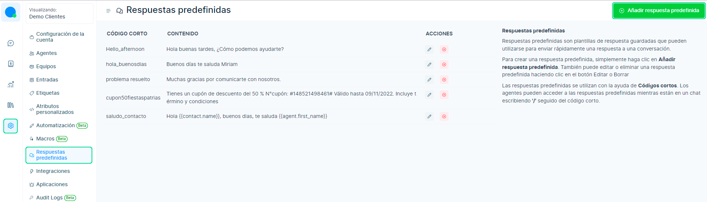
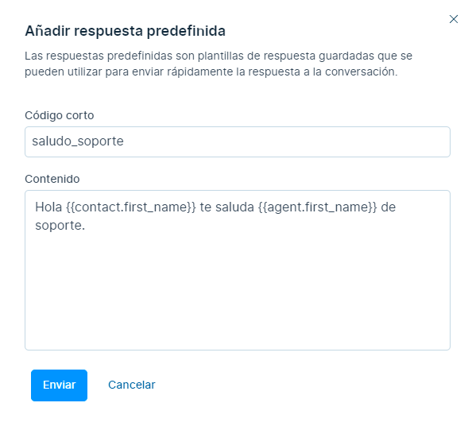
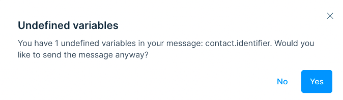

# Variables de respuestas predefinidas  

Las variables son texto de marcador de posición en los mensajes, que se reemplazan dinámicamente en función de la información que ha proporcionado.  

Cuando se crea un mensaje con variables, se reemplazará por el valor apropiado.  

## Módulo Ajustes  
Primero ingresamos al módulo **Ajustes** ⚙️, luego a **Respuestas predefinidas** y seleccionamos el botón **Añadir respuesta predefinida**.  

  

## Creando mensaje con variable  
Posteriormente aparecerá el siguiente formulario, con los siguientes campos:  
* **Código corto**: Es el nombre de la respuesta predefinida, por ejemplo, **"Saludo_soporte"**.  
* **Contenido**: En esta sección crearás el mensaje insertando la variable.  
  
Para usar una variable, escribe dos corchetes dobles **\{\{ \}\}** al redactar un nuevo mensaje o crear una respuesta estándar. Aparecerán las variables y podrás seleccionar la que desees utilizar.  

**Ejemplo**: Hola \{\{contact.first_name\}\} te saluda \{\{agent.first_name\}\} de soporte.  

  

:::success  
**NOTA**: ChatBúho admite variables en respuestas **predefinidas/macros/automatización**.  
:::  

## Lista de variables de respuestas predefinidas  

|       Variable       |                        Descripción                       |  
|:--------------------:|:--------------------------------------------------------:|  
| \{\{conversation.id\}\}      | Versión numérica de la identificación de la conversación |  
| \{\{contact.id\}\}           | Versión numérica de la identificación del contacto       |  
| \{\{contact.name\}\}         | Nombre completo del contacto                             |  
| \{\{contact.first_name\}\}   | Nombre de contacto                                      |  
| \{\{contact.last_name\}\}    | Apellido de contacto                                    |  
| \{\{contact.phone_number\}\} | Teléfono de contacto                                    |  
| \{\{agent.name\}\}           | Nombre completo del agente                              |  
| \{\{agent.first_name\}\}     | Nombre del agente                                       |  
| \{\{agent.last_name\}\}      | Apellido del agente                                     |  
| \{\{agent.phone_number\}\}   | Número de teléfono del agente                           |  

**¿Qué pasa si la variable no existe?**  

Si intentas enviar una variable indefinida, se mostrará una advertencia.  

