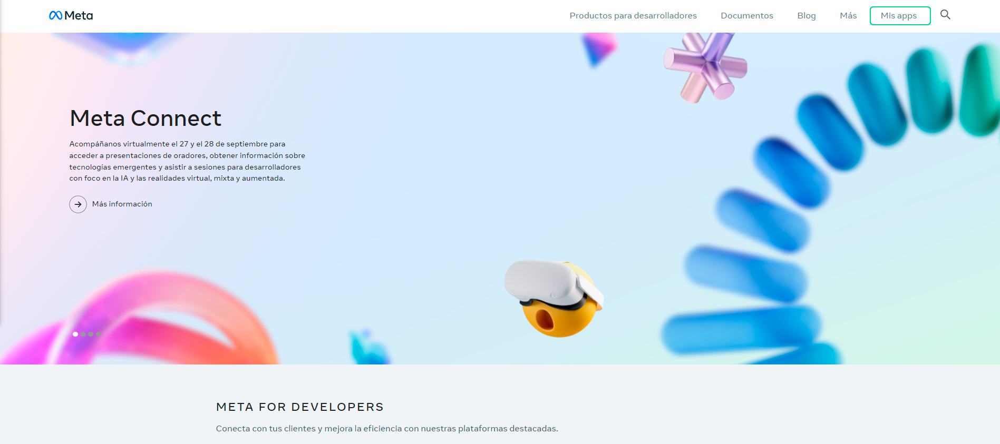
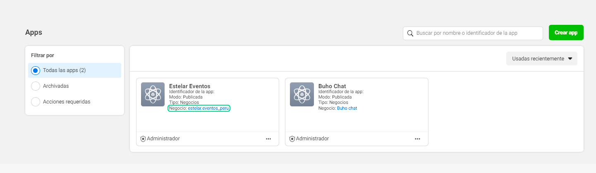
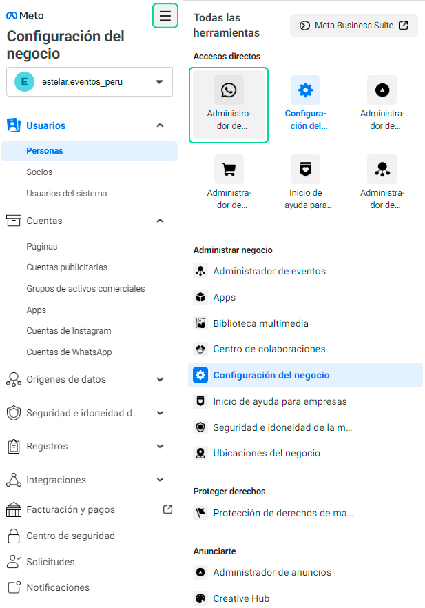
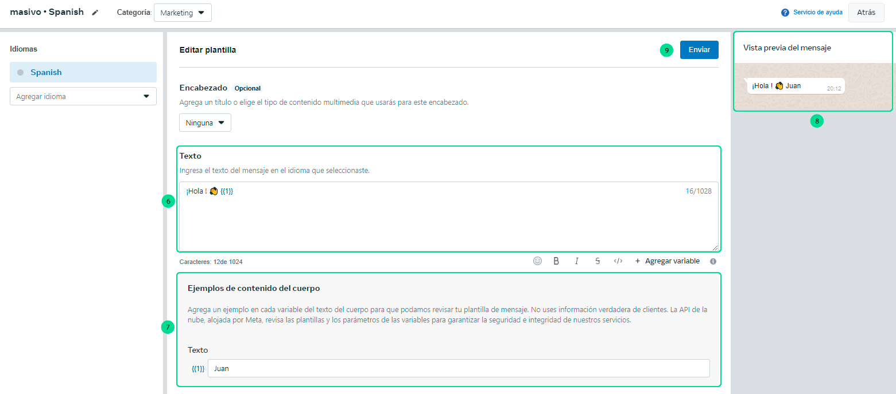
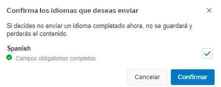
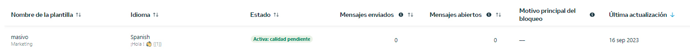

# Plantillas para mensajes masivos  

En este artículo te enseñaremos a crear tu plantilla de mensajes que utilizarás para enviar mensajes masivos en **[https://chat.buho.la/wam](https://chat.buho.la/wam)**.  

### 1. Ingresar a Facebook Developers  

Ingresa a este link **[Facebook developer](https://developers.facebook.com/?locale=es_ES)**. Visualizarás la página de Facebook Developers y se ingresará a **My Apps**. En caso de no tener una cuenta creada, en la misma ubicación aparecerá un botón de **Iniciar, Empezar o Get Started**, que se deberá seleccionar para crear la cuenta de Facebook Developers.  

Regístrate con tu cuenta de Facebook relacionada a tu Página de Facebook.  

  

### 2. Ingresa al negocio  

Luego, ingresa al negocio de tu aplicativo que aparece en **texto azul**.  

  

### 3. Ingresa al administrador de WhatsApp  

Luego, serás redirigido a la configuración del negocio y deberás ingresar al ícono de todas las herramientas **>** **Administrador de WhatsApp**.  

  

### 4. Selecciona el negocio  

Primero, deberás seleccionar el negocio **>** luego ubicarte en **Plantillas de mensajes** **>** después selecciona la **cuenta de WhatsApp (número de integración)**.  

  

### 5. Crear plantilla  

Para crear la plantilla, sigue estos pasos:  

1. Selecciona el botón **Crear plantillas**.  

  

2. Selecciona la categoría **Marketing > Personalizado**.  
3. Ingresa el nombre de la plantilla, sugerencia: **masivo**.  
4. Selecciona el idioma **Spanish**, no otro tipo de español.  
5. Selecciona el botón **Continuar**.  

  

6. En la sección de texto, se sugiere añadir lo siguiente: un saludo y una variable: **¡Hola! 👋 \{\{1\}\}**.  
7. En ejemplos de contenido del cuerpo, coloca un nombre para previsualizar el uso de la plantilla.  
8. En vista previa del mensaje, visualizarás el ejemplo.  
9. Luego selecciona el botón **Enviar**.  

:::info  
**¿QUÉ ES UNA VARIABLE?**  
Una variable se utiliza para almacenar información. El **\{\{1\}\}** será reemplazado por el texto que coloques ahí y es modificable.  
:::  

  

10. Confirma el idioma **Spanish**.  

  

11. La plantilla estará en **estado de revisión**.  

  

12. Finalmente, en un tiempo aproximado de **24 horas**, visualizarás el estado de la plantilla en activo.  

  

Listo, ya puedes usar la plantilla para tus **[mensajes masivos](../herramientas-adicionales/Mensajes-masivos.md)**.