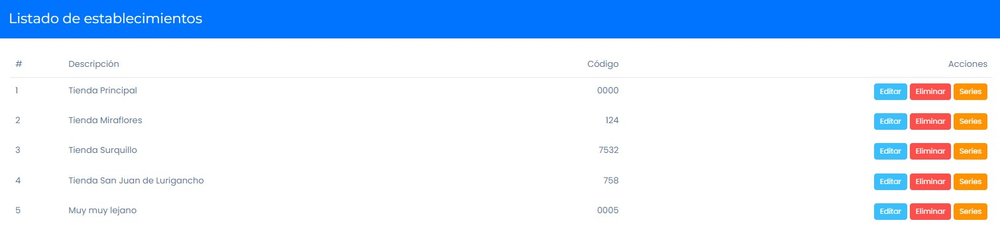

# Series para Movimientos de Inventario

Debido a nuevas actualizaciones, se deben configurar estas series adicionales en los establecimientos creados partir de diciembre 2022, para que se permita **[los movimientos libres de inventario:](https://fastura.github.io/documentacion/inventario/Movimientos-libres-de-inventario)**

Esto lo realiza dentro del módulo USUARIOS, LOCALES&SERIES - ESTABLECIMIENTOS. Dando clic en el botón **SERIES**.

:::info importante

El correlativo de la serie , ejemplo en NTA1 (Correlativo es 1), varia por cada establecimiento, en el segundo establecimiento será NTA2, en el tercero NTA3, etc.

:::
