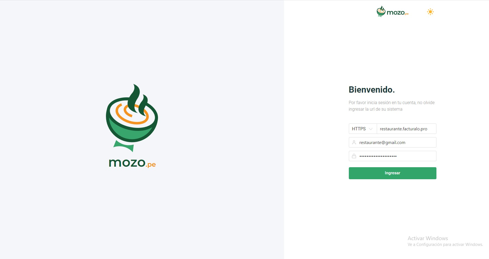

# Introducción a Mozo

### Introducción

El **Sistema para Mozo** es una solución integral diseñada para agilizar y optimizar las operaciones de restaurantes, bares y cafeterías. Este sistema facilita el trabajo del personal de servicio, permitiéndoles gestionar de manera eficiente mesas, pedidos y comandas, a la vez que interactúan directamente con un módulo de Punto de Venta (POS) para la facturación y cobro.

Con este sistema, los mozos pueden asignar y controlar el estado de las mesas, tomar pedidos rápidamente y enviar las comandas de manera automática a la cocina o barra. Todo ello está integrado dentro de un flujo de trabajo que mejora la experiencia del cliente, reduce errores en los pedidos y optimiza el tiempo de servicio.

Para probar la demo del sistema, puedes acceder a través del siguiente enlace:

**[Sistema para Mozo - Demo](https://mozo.pe/app)**  

https://restaurante.demo3pro6.ibu.pe

**Correo:** restaurante@gmail.com 

**Contraseña:** midemo@gmail.com
