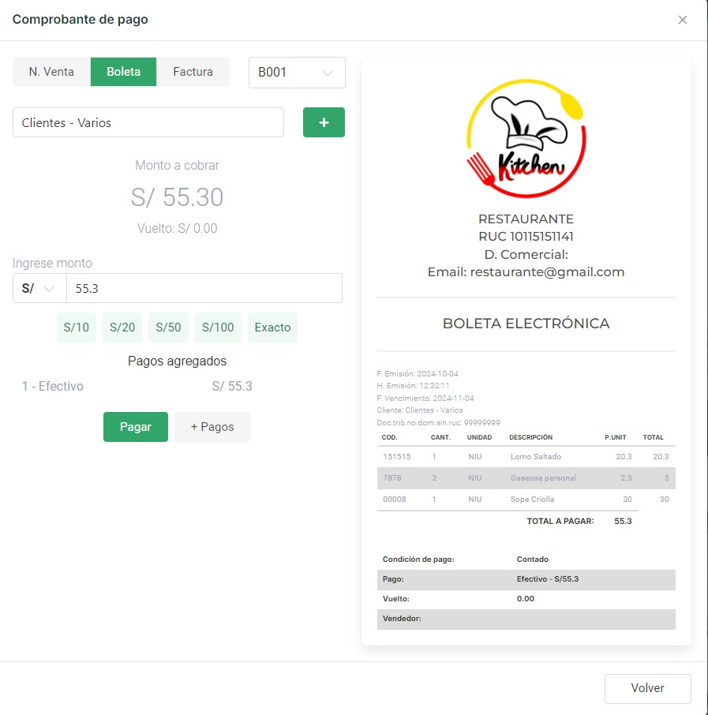

# POS
### Módulo POS

El **Módulo POS** es una herramienta clave dentro del Sistema para Mozo, que permite gestionar de manera rápida y eficiente los pedidos, especialmente cuando los clientes solicitan comida para llevar.

Este módulo facilita la preparación de los comprobantes de venta y ofrece una interfaz amigable donde se muestran las categorías de productos disponibles. Además, cuenta con un **input de búsqueda** que permite localizar productos de manera rápida, ya sea escribiendo el nombre del producto o utilizando un **lector de código de barras**.

Una vez que el pedido está listo, al seleccionar la opción de **Finalizar Venta**, el sistema presenta un menú que permite al usuario elegir el tipo de comprobante (boleta, factura, etc.) y asignar el cliente correspondiente. También se puede seleccionar la **serie del comprobante**, garantizando que el proceso de facturación cumpla con los requisitos de numeración y emisión establecidos.

Este flujo optimizado ayuda a los mozos a gestionar las ventas de manera ágil, mejorando tanto la eficiencia del servicio como la satisfacción del cliente.
