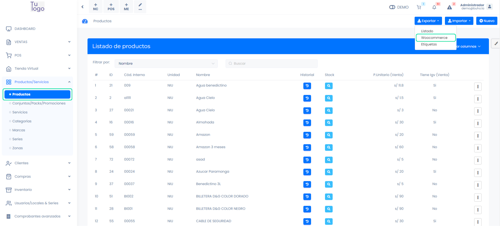
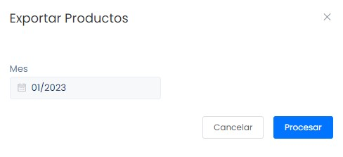
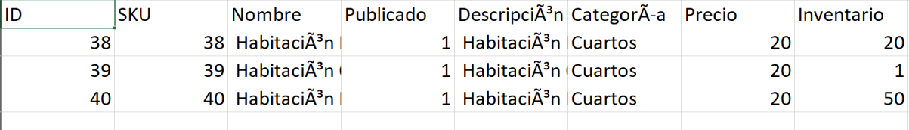
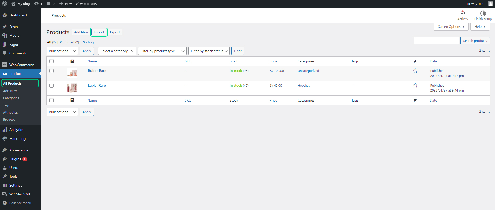
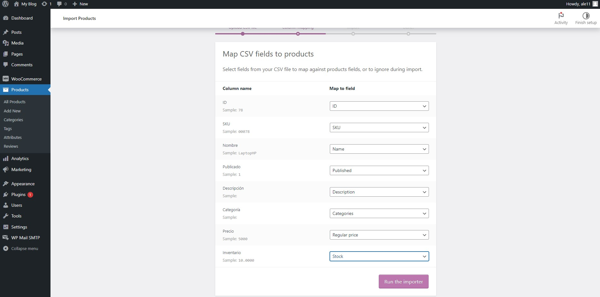
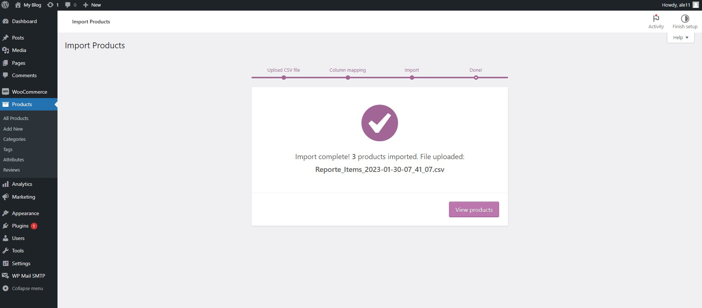
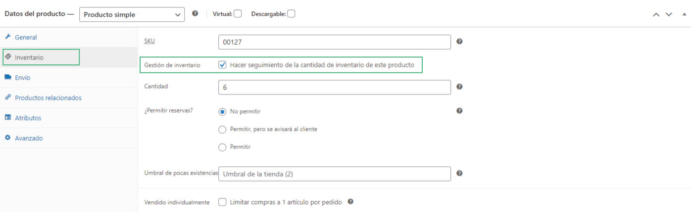

# Agregar productos conectados a mi sistema de facturación

Con la ayuda del plugin del sistema de facturación, tus productos en el sistema y los productos de tu tienda virtual estarán sincronizados en cuanto al stock.

En este artículo te enseñaremos a como subir tus productos del facturador a tu web. Sigue estos pasos para realizarlo:

## Exportación

Para realizar la exportación de los productos, ingresa al módulo de **Productos** y selecciona la subcategoría **Productos**. En la parte superior derecha selecciona el botón **Exportar**, seguido selecciona **Woocommerce**.

Seguido, aparecerá una ventana emergente de Exportar Productos. Selecciona el mes y selecciona el botón **Procesar**.

Se descargara un archivo en formato **Excel**.

:::info IMPORTANTE:

- El nombre del producto debe estar en la casilla Nombre, y en la casilla **Publicado** debe insertar el número 1.
- La categoría tiene que estar previamente creada previamente.
- La exportación cuenta con un campo stock, que es llevado a los productos de Wordpress, al realizar una venta de al menos un ítem y generar un comprobante, el stock se verá afectado tanto en el facturador como en woocommerce, para que esto suceda los productos deben contar con código interno en el facturador.

:::

## Importación

En WordPress, ingresa al menú Productos y selecciona el botón **Importar**.

Lo siguiente es cargar el archivo en formato Excel y selecciona el botón **Continuar**.

Sigue estos pasos para completar los siguientes campos, tal como se muestra en la imagen a continuación. Luego, selecciona el botón **"Ejecutar el importador"**. Dependiendo de la cantidad de productos, esto tomará un tiempo.

Al finalizar se le mostrará una pantalla con el resultado.

:::info IMPORTANTE:

Para poder manejar el inventaro, debe activar la opción gestión de inventario por producto.

Al activar la opción, solo se permitirá la venta de la cantidad de productos disponible. Cuando se agote el stock, el producto continuará siendo visible en la tienda virtual, pero no podrá ser agregado al carrito de compras.

:::
