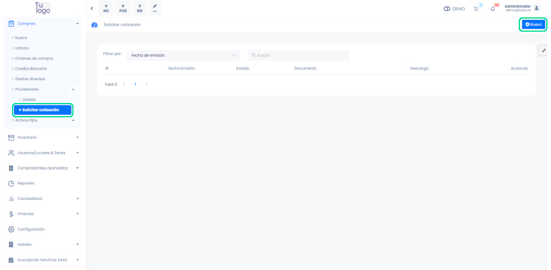
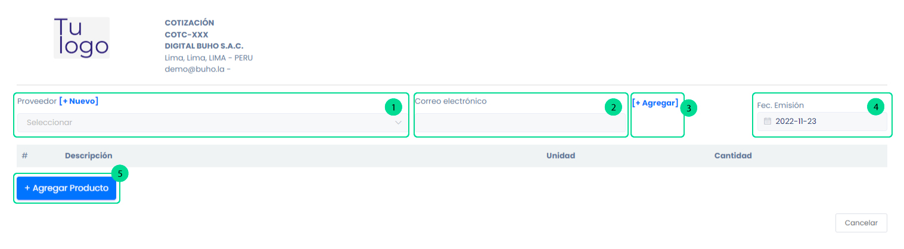
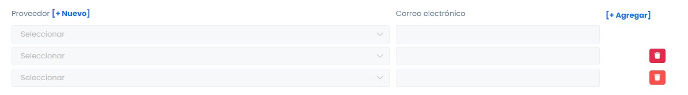
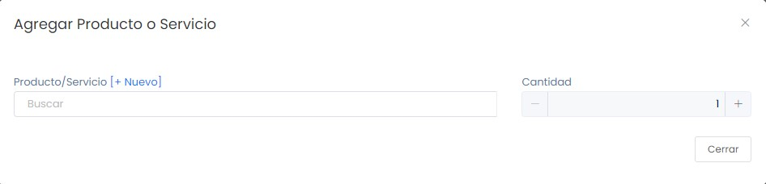

# Proveedores: Solicitar cotización

En esta área te ayudaremos a solicitar una cotización a tus proveedores. Sigue estos pasos para realizarlo:

Ingresa al módulo de **Compras** y luego selecciona **Proveedores** seguidamente la subcategoría **Solicitar cotización**. En la parte superior derecha selecciona el botón **Nuevo**.

## Generar cotización

Complete los siguientes campos:

1. **Proveedor:** Selecciona el proveedor para la creación del comprobante, si no está creado, podrá realizarlo paso a paso en este artículo.

2. **Correo electrónico:** Ingresa el correo electrónico.

3. **Botón agregar:** Al seleccionar este botón te crea un campo de campo adicional, para poder agregar un nuevo proveedor y correo electrónico.

4. **Fecha de emisión:** Ingresa la fecha de emisión del comprobante.

5. **Agregar producto:** Al seleccionar este botón se abrirá una ventana de **Agregar Producto o Servicio**. Agregue la cantidad a cotizar.

6. **Producto/Servicio:** Selecciona el producto o servicio, si no está creado, podrá realizarlo paso a paso en este **[artículo](https://fastura.github.io/documentacion/docs/Pro6/productos-servicios/Productos-Creacion-avanzada).**

Luego presione el botón **Agregar**, observará los productos añadidos en el comprobante.

Finalmente presione el botón **Generar**. Podrá imprimir el comprobante si así lo desea.
