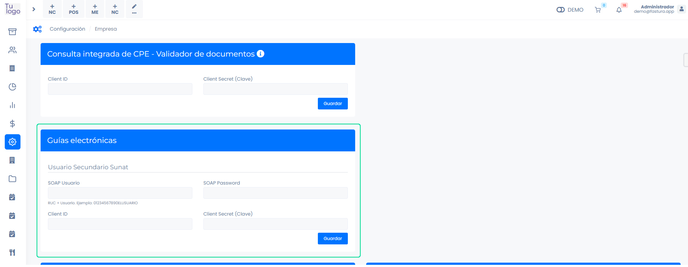
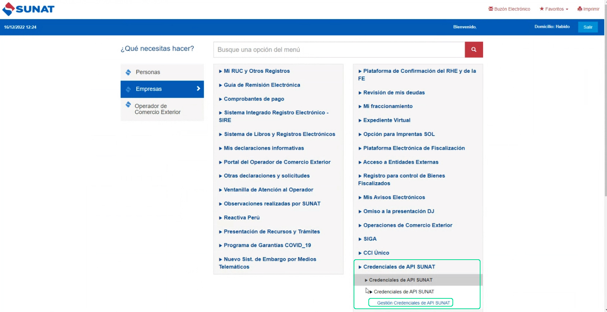
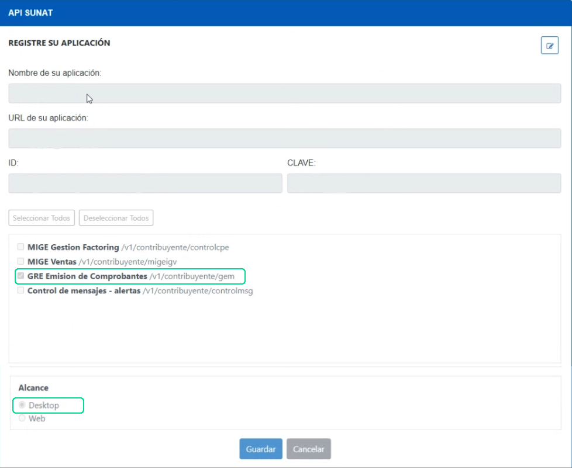
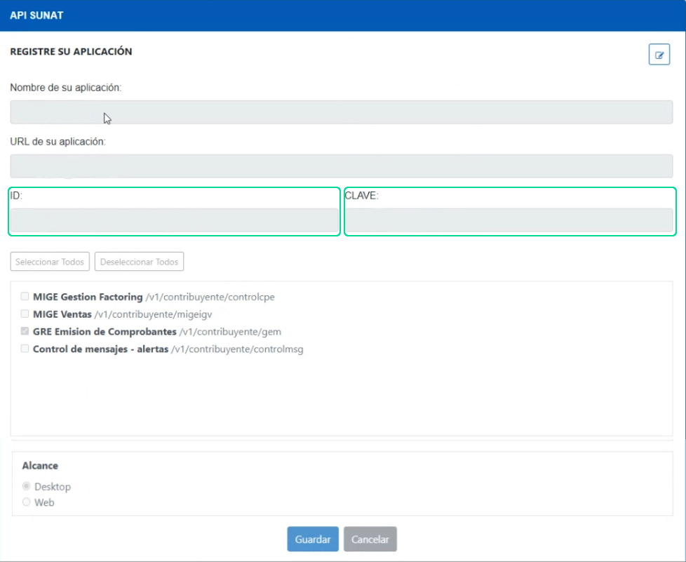
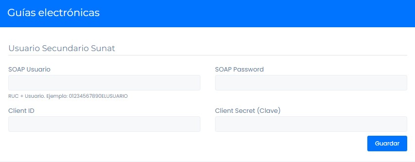

# Configuración previa - Guía de remisión

Ingresa al módulo **Configuración** y en la subcategoría **Empresa**, selecciona **Empresa**

Deberá completar los siguientes campos:

* **SOAP Usuario:** Para completar este campo, coloque el usuario secundario creado al configurar su cuenta por primera vez.
* **SOAP Password:**  Para completar este campo,  coloque la contraseña del usuario secundario creado al configurar su cuenta por primera vez.

:::danger importante

Para llenar **Client ID** y **Client Secret (Clave)** debe ingresar a la plataforma SUNAT con la clave **SOL**.

:::

Al ingresar a SUNAT, seleccionamos **Credenciales de API SUNAT/ Credenciales de API SUNAT/ Credenciales de API SUNAT** y por último **Gestión Credenciales de API SUNAT**.

Para registrar la aplicación, tendrá que completar:

* **Nombre de su aplicación:** Ingresa el nombre de su aplicación. Por ejemplo: Factura fácil.
* **URL de su aplicación:** Ingresa la URL de su aplicación. Por ejemplo: [buho.fastura.app](https://buho.fastura.app)
* **Casillas de selección:** Selecciona la casilla GREE Emision de Comprobantes/v1/contribuyente/gem.
* **Alcance:** Selecciona la casilla Desktop.
Después selecciona el botón **Guardar**, se generará un token en los campos **ID** y **CLAVE**.

Copiamos esos accesos y lo pegamos en:

* **SOAP Usuario:** Para completar este campo, coloque el usuario secundario creado al configurar su cuenta por primera vez.
* **SOAP Password:**  Para completar este campo,  coloque la contraseña del usuario secundario creado al configurar su cuenta por primera vez.
* **ID -> Client ID**
* **CLAVE -> Client Secret (Clave)**

Selecciona el botón **Guardar** y ya puede generar su guía. Conoce como en el siguiente **[artículo](https://fastura.github.io/documentacion/comprobantes-avanzados/Generar-gu%C3%ADas-de-remision)**.
