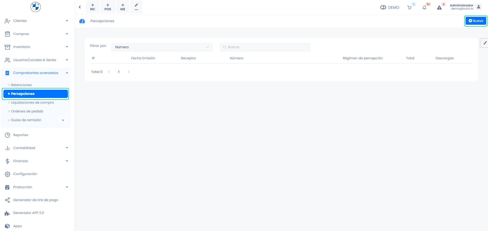
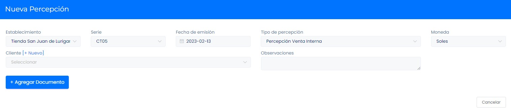
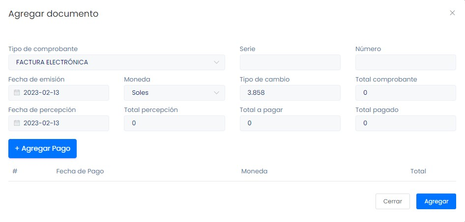
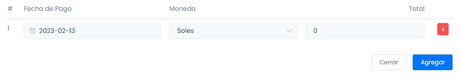

# Crear documentos de percepción

En este artículo te enseñaremos a crear documentos de percepción. Sigue estos pasos para realizarlo:

Ingresa al módulo **Comprobantes avanzados** y selecciona la subcategoría **Percepciones**, selecciona el botón selecciona **Nuevo**.

Completa los siguientes datos:

- **Establecimiento:** Selecciona el establecimiento desde cual esta realizando el documento de detracción.
- **Tipo de percepción:** Selecciona el tipo de percepción según lo que más le convenga.
- **Cliente:** Selecciona el Cliente a quien le realizaras el documento de percepción, si aún no esta creado puede crearlo siguiendo este [artículo](#Clientes: Creación individual).
- **Observaciones:** Inserta alguna observación.
- **Selecciona el botón Agregar Documento:**

- **Tipo de comprobante:** Selecciona el tipo de comprobante si es factura o boleta.
- **Serie:** Ingrese la serie del comprobante.
- **Número:** Ingrese el número del comprobante.
- **Fecha de emisión:** Selecciona la fecha de emisión.
- **Moneda:** Seleccione si la moneda es en soles o dólares.
- **Total comprobante:** Ingresa el total del monto del comprobante.
- **Fecha de retención:** Selecciona la fecha de retención.
- **Total retención:** Se auto completa el Total comprobante por Tasa de retención.
- **Total a pagar:** Ingresa el total a pagar.
- **Total pagado:** Ingresa el total pagado.

- **Selecciona el botón Agregar Pago:**

- **Fecha de Pago:** Selecciona la fecha de pago.
- **Moneda:** Selecciona si el tipo de moneda.
- **Total:** Ingrese el monto total del comprobante.

Seguido selecciona el botón **Agregar** y después **Generar**.
