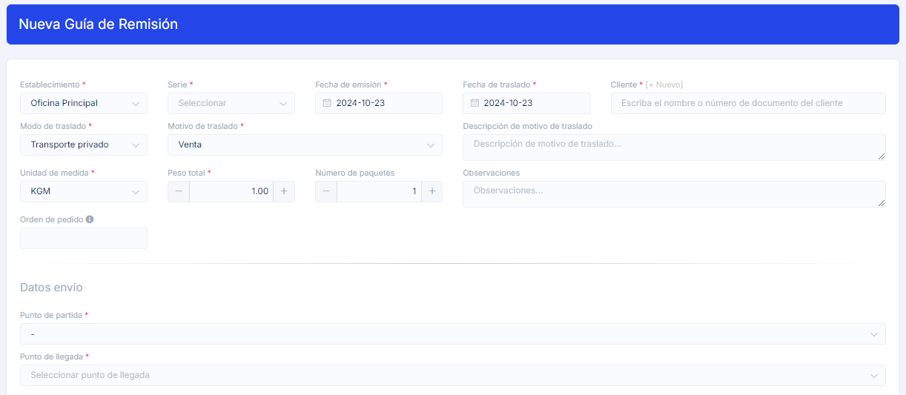
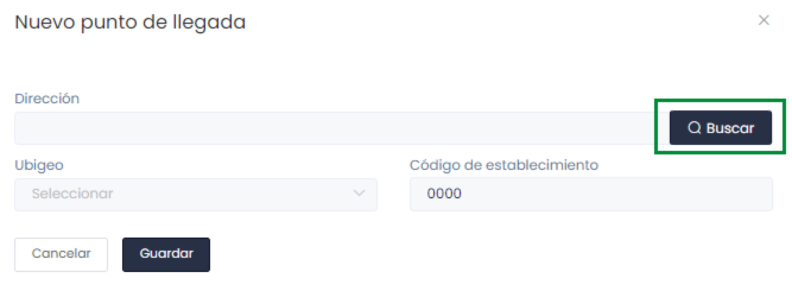
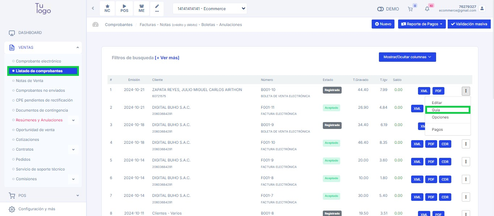
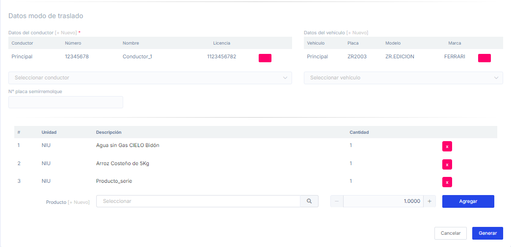

# Generar Guías de Remisión

:::danger IMPORTANTE:
Por disposición de SUNAT con respecto a las guías de remisión, es necesario agregar tokens de conexión adicionales. Tenemos una guía preparada en este **[artículo](https://fastura.github.io/documentacion/comprobantes-avanzados/Generar-guías-de-remision)**.
:::

En este artículo te enseñaremos cómo generar tus guías de remisión. Sigue estos pasos para realizarlo:

## Crear Guía de Remisión: Botón Nuevo

1. Ingresa al módulo de **Comprobantes Avanzados** en la subcategoría **Guías de Remisión** y selecciona **G.R Remitente**.
2. En la parte superior derecha, selecciona el botón **Nuevo**.

Tendrás que rellenar los siguientes campos necesarios:

- **Establecimiento:** Selecciona el establecimiento.
- **Serie:** Selecciona la serie correspondiente.
- **Fecha de emisión:** Ingresa la fecha de emisión.
- **Fecha de traslado:** Ingresa la fecha de traslado.
- **Cliente:** Selecciona el cliente, si no está creado, podrá realizarlo paso a paso en este **[artículo](https://fastura.github.io/documentacion/clientes/Clientes-creacion-individual)** artículo, también puede crear un nuevo cliente seleccionando el botón **+Nuevo.**
- **Modo de traslado:** Selecciona si el modo es **transporte privado o público**.
- **Motivo de traslado:** Selecciona el motivo más adecuado, entre opciones como:
  - Venta
  - Compra
  - Traslado entre establecimientos de la misma empresa
  - Importación
  - Exportación
  - Otros no comprendidos en ningún código del catálogo
  - Venta sujeta a confirmación del comprador
- **Unidad de medida:** Selecciona entre las dos unidades disponibles por SUNAT: **KGM** (Kilogramos) o **TNE** (Toneladas).
- **Peso total:** Ingresa el peso total del producto.
- **Número de paquetes:** Ingresa el número total de paquetes que se trasladarán.

## Datos de Envío:

- **Punto de partida:** Selecciona o crea un nuevo punto de partida con el botón **+Nuevo**.
- **Punto de llegada:** Selecciona o crea un nuevo punto de llegada con el botón **+Nuevo**.

:::danger IMPORTANTE:
Si el punto de llegada no carga correctamente, usa el botón **+Nuevo** y selecciona **Buscar** seguido de **Guardar** sin necesidad de llenar todos los campos.
:::

# DATOS DE MODELO DE TRASLADO 

## Datos del Modo de Traslado: Transporte Privado

- **Datos del conductor:** Selecciona uno o varios conductores, también puedes crear un nuevo conductor con el botón **+Nuevo**.
- **Datos del vehículo:** Selecciona uno o varios vehículos y sus números de placas correspondientes, o crea un nuevo vehículo con el botón **+Nuevo**.

## Datos del Modo de Traslado: Transporte Público

- **Datos del transportista:** Selecciona el transportista o crea uno nuevo con el botón **+Nuevo**.

:::info IMPORTANTE
- Las unidades de medida válidas según SUNAT son: **KGM y TNE**.
- El sistema usa por defecto la dirección del cliente seleccionado, pero puedes agregar una nueva dirección desde el módulo de clientes.
- Para registrar una empresa de transportistas, es obligatorio contar con el MTC, que puedes solicitar en el siguiente link:
  **[https://www.mtc.gob.pe/tramitesenlinea/tweb_tLinea/tw_consultadgtt/Frm_rep_intra_mercancia.aspx](https://www.mtc.gob.pe/tramitesenlinea/tweb_tLinea/tw_consultadgtt/Frm_rep_intra_mercancia.aspx)**.
- La placa del vehículo no puede contener guiones ni minúsculas.
- En caso de elegir esta opción, tendrá que especificar la fecha de entrega al transportista.
:::

## Agregar Producto:

1. Para agregar el producto a trasladar:

.jpg)

   - **Producto:** Ingresa el nombre del producto en la descripción. Si necesitas crear uno nuevo, selecciona el botón **+Nuevo** y sigue los pasos en este **[artículo](https://fastura.github.io/documentacion/productos-servicios/Productos-Creacion-basica).**
   - **Cantidad:** Ingresa la cantidad del producto.

2. Una vez completado, selecciona el botón **Agregar** y luego **Generar**.

---

## Crear Guía de Remisión a partir de un Comprobante

**1. Si necesitas generar una guía de remisión a partir de una factura:**

Ingresa al módulo de **VENTAS** en la subcategoría **Listado de Comprobantes**.

Selecciona los tres puntos a la derecha de la factura en la lista de comprobantes y selecciona **Guía**.

2. Te redirigirá automáticamente a la sección de **Guías de Remisión**.

3. Algunos campos se completarán automáticamente con la información de la factura, y solo tendrás que completar los campos faltantes de la manera ya explicada anteriormente.

---
