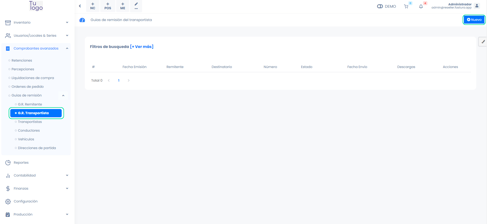
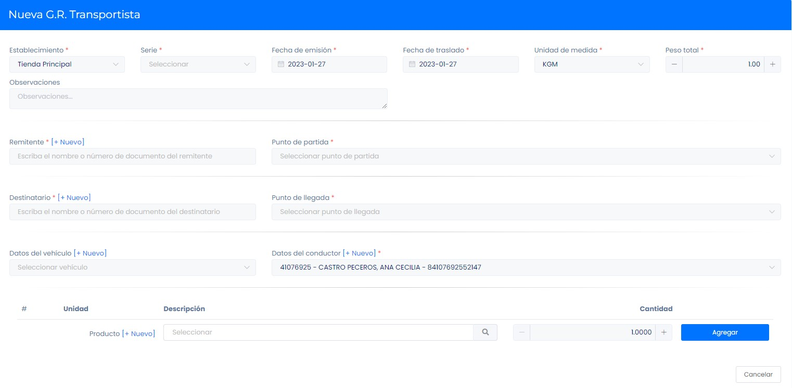
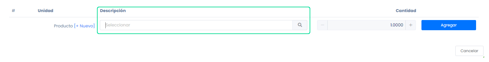

# Guías de transportistas

En este artículo te enseñaremos a como generar tus guías de remisión. Sigue estos pasos para realizarlo:

Ingresa al módulo de **Comprobantes avanzados** en la subcategoría **Guías de remisión** y selecciona **G.R Transportista**. En la parte superior derecha selecciona el botón Nuevo.

Tendrá que rellenar los siguientes campos:

- **Establecimiento:** Selecciona el establecimiento.
- **Serie:** Selecciona la serie.

:::info IMPORTANTE
 La serie previamente configurada en el módulo **Usuarios/Locales & Series**, categoría **Establecimientos**, la series inicia **V001**.
:::

- **Fecha de emisión:** Ingresa la fecha de emisión.
- **Fecha de traslado:** Ingresa la fecha de traslado.
- **Unidad de medida:** Selecciona la unidad de medida que más se acomode a sus requerimientos.
- **Peso total:** Ingresa el peso total del producto.
- **Remitente:** Selecciona al remitente, también puede crear un nuevo punto de llegada seleccionando el botón +Nuevo.
- **Punto de partida:** Selecciona el punto de partida correspondiente, también puede crear un nuevo punto de partida seleccionando el botón +Nuevo.
- **Destinatario:** Selecciona el destinatario correspondiente, también puede crear un nuevo punto de partida seleccionando el botón +Nuevo.
- **Punto de llegada:** Selecciona el punto de llegada, también puede crear un nuevo punto de llegada seleccionando el botón +Nuevo.

:::info IMPORTANTE

 Si el punto de llegada no carga una vez seleccionado el cliente, selecciona el botón +Nuevo y sin necesidad de llenar algún dato seguido selecciona el botón Buscar y una vez cargado los datos selecciona el botón **Guardar**.

:::

- **Datos del vehículo:** Selecciona uno o varios vehículos y sus números de placas correspondientes, o crea un nuevo vehículo con el botón **+Nuevo**.
- **Datos del conductor:** Selecciona uno o varios conductores, también puedes crear un nuevo conductor con el botón **+Nuevo**.

## Agregar producto

Para agregar el producto que va a trasladar

- **Producto:** Ingresa el nombre del producto en descripción, selecciona, en caso desee crear un nuevo producto, selecciona el botón Nuevo y sigue los pasos en este **[artículo](https://fastura.github.io/documentacion/productos-servicios/Productos-Creacion-basica)**.
- **Cantidad:** Ingresa la cantidad del producto.

Una vez completado los campos de producto, selecciona el botón **Agregar**, selecciona el botón **Generar**.
