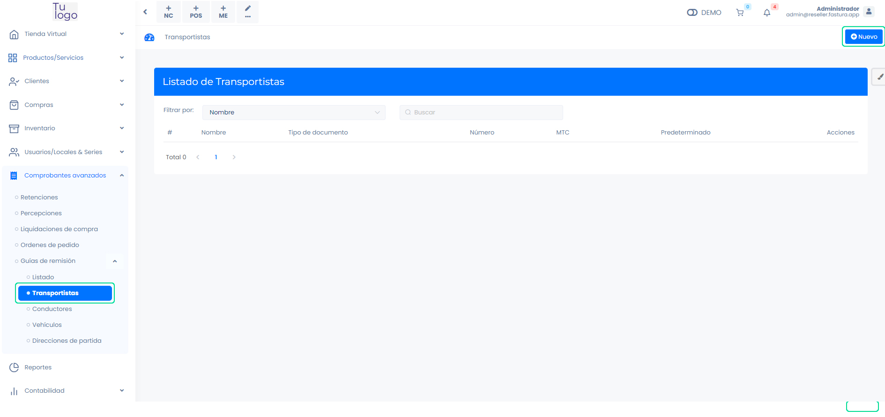
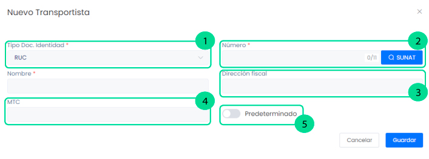

# Creación de transportistas

En este artículo te enseñaremos a como crear transportistas para tu guía de remisión. Sigue estos pasos para realizarlo:

Ingresa al módulo de **Comprobantes avanzados** y luego selecciona Guías de remisión y seguido la subcategoría Transportistas.
En la parte superior derecha selecciona el botón **Nuevo.**

## Crear nuevo transportista

Completa los siguientes campos:

**1. Tipo Doc. Identidad:** Selecciona el tipo de documento:  Doc.trib.no.dom.sin.ruc, DNI, CE, RUC, Pasaporte.

**2. Número:** Ingresa el número del documento según lo que selecciono. Seguido selecciona el botón RENIEC o SUNAT, se autocompletará el nombre.

**3. Dirección fiscal:** Ingresa su dirección fiscal.

**4. MTC:** Este dato se lo puede brindar la empresa. O buscarlo en el siguiente link: **[https://www.mtc.gob.pe/tramitesenlinea/tweb_tLinea/tw_consultadgtt/Frm_rep_intra_mercancia.aspx](https://www.mtc.gob.pe/tramitesenlinea/tweb_tLinea/tw_consultadgtt/Frm_rep_intra_mercancia.aspx)**

**5. Predeterminado:** Activa si el transportista es de manera frecuente.

Seguido seleccione el botón **Guardar**. Y podrá visualizar al transportista creado.
