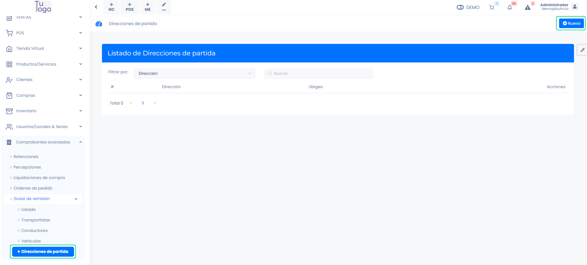
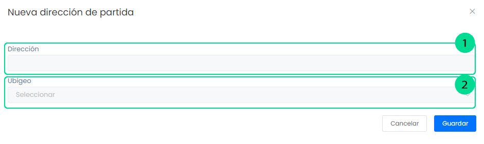

# Direcciones de partida

En este artículo te enseñaremos a como crear diferentes direcciones de partida, para tu guía de remisión. Sigue estos pasos para realizarlo:

Ingresa al módulo de **Comprobantes avanzados** y luego selecciona **Guías de remisión** y seguido la subcategoría **Direcciones de partida**. En la parte superior derecha selecciona el botón **Nuevo**.

Completa los siguientes campos:

- **Dirección:** Inserta la dirección de la nueva dirección de partida.
- **Ubigeo:** Inserta el ubigeo de la dirección insertada.

Seguido seleccione el botón **Guardar**. Y podrá visualizar la nueva dirección de partida creada.
