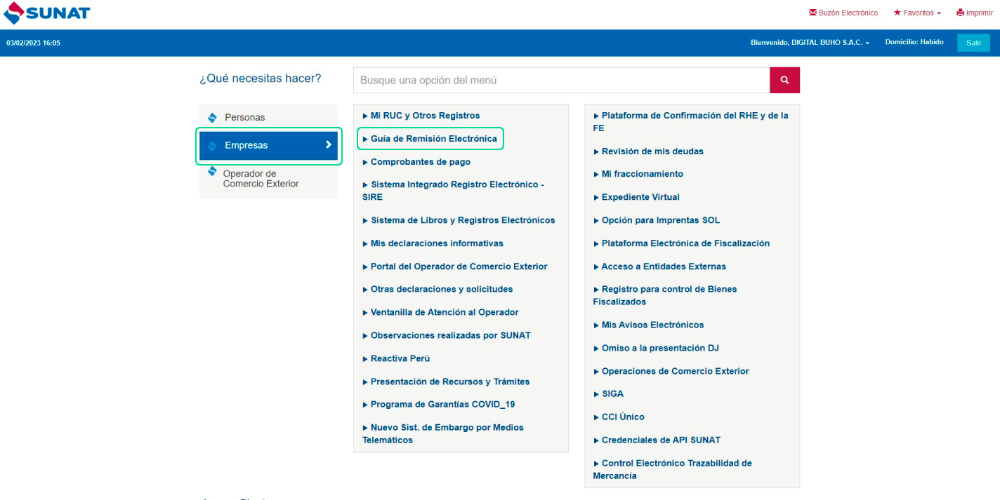
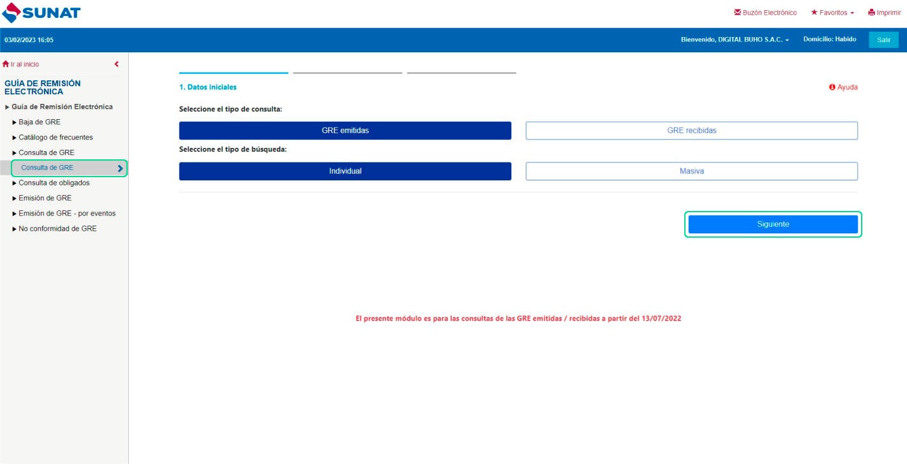
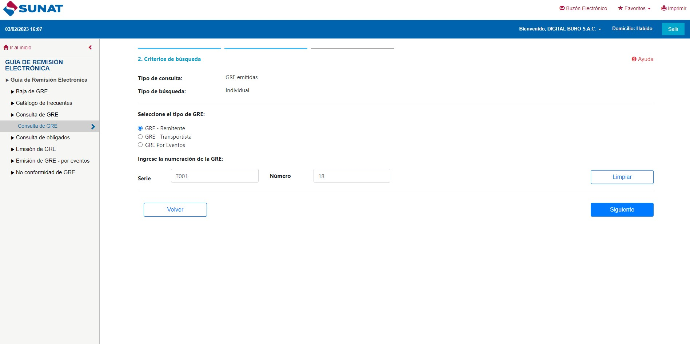
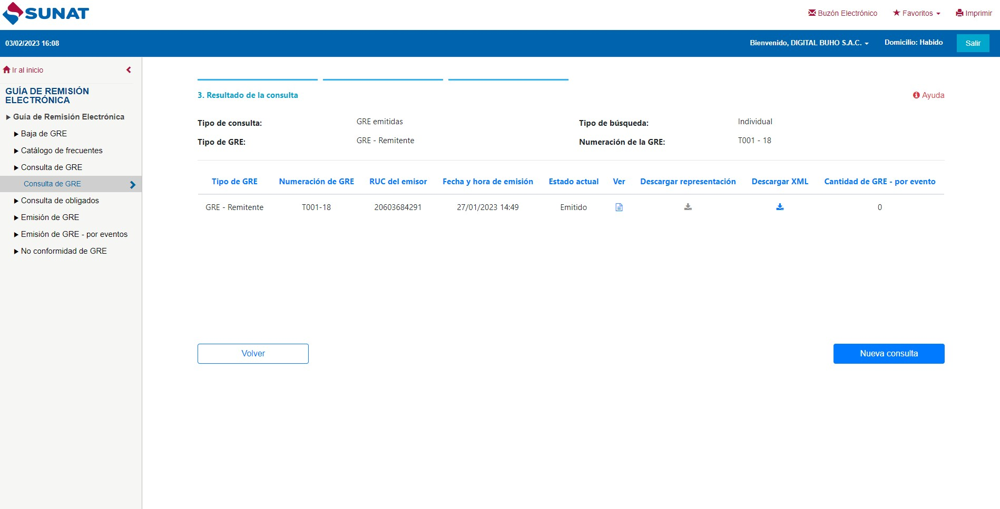

# Consulta guía de remisión en SUNAT

En este artículo te enseñaremos a consultar guías de remisión. Las guías de Remisión Electrónica **(GREE)** se pueden consultar en la SUNAT con la clave **SOL**. Sigue estos pasos para realizarlo:

Ingresa al portal de sunat con su clave **SOL**, selecciona **Empresas** y seguido selecciona **Guía de Remisión Electrónica.**

Dentro selecciona **Consulta GREE**:

Puede seleccionar:

- **Tipo de consulta:** Si es una guía emitida o recibida.
- **Tipo de búsqueda:** Si va a buscar la guía de manera individual o de manera masiva.
Seguido selecciona el botón **Siguiente**.

* Selecciona el tipo de GREE.
* Ingresa la númeración del GREE.

Selecciona el botón **Siguiente**. Seguido podrá visualizar la guía de remisión, podrá descargar PDF, descargar XML.

:::danger IMPORTANTE:
* Esta opción es muy útil para consultar las GRE que tengan error"1033
*  El comprobante fue registrado previamente con otros datos".
* Desde esta opción se puede imprimir el PDF con QR.
:::
