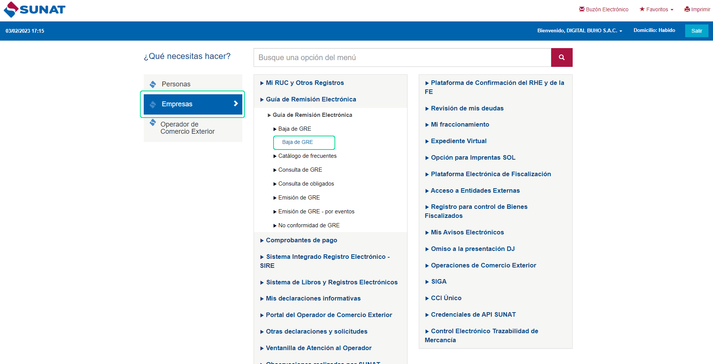
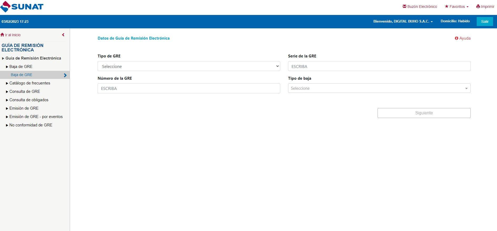
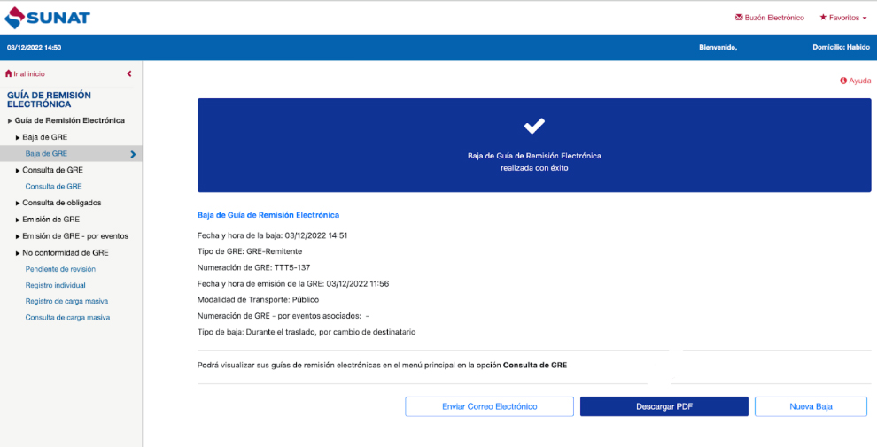

# Dar de baja una guía de remisión en SUNAT

En este artículo te enseñaremos a consultar guías de remisión. Las Guías de Remisión Electrónica (GRE) se pueden dar de baja únicamente desde la SUNAT con la Clave Sol. Sigue estos pasos para realizarlo:

Ingresa al portal de sunat con su clave SOL, selecciona **Empresas** y seguido selecciona Guía de Remisión Electrónica, seguido selecciona Baja de GRE.

Completa los siguientes datos:

Selecciona siguiente. Y podrá observar la guía de baja.

