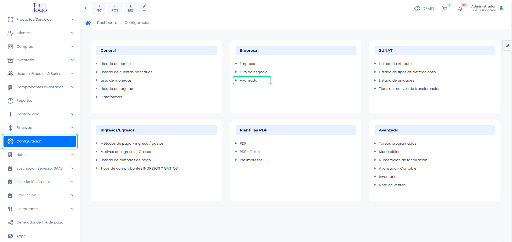
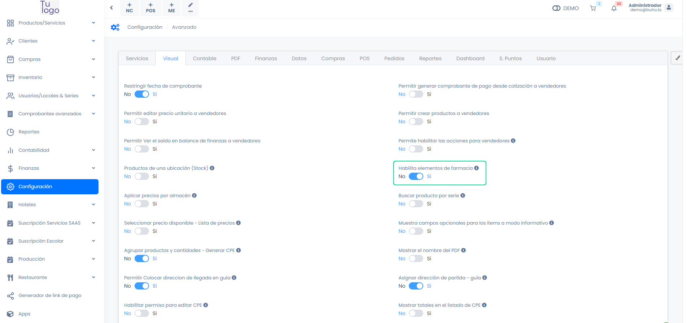
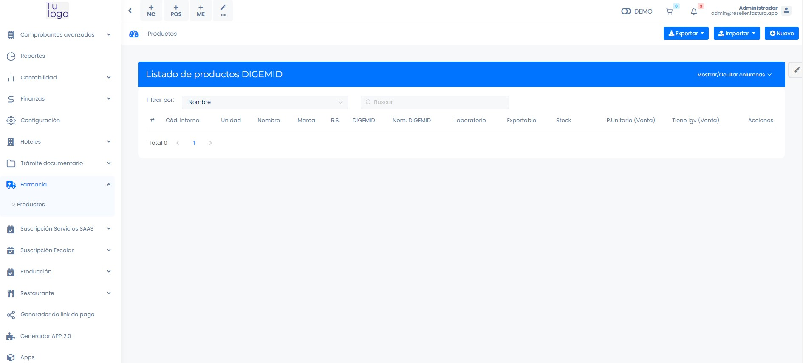

# Configuración Previa

En este artículo te enseñaremos a realizar la configuración previa para empezar a utilizar el módulo Farmacia. Sigue estos pasos para realizarlo:

Ingresa al módulo de **Configuración**, y luego en la subcategoría **Empresa**, selecciona **Avanzado**.

La configuración que debe estar activa :

Nos permite que dentro del módulo de Farmacia, tengamos un catálogo propiamente de farmacia, que pueden ser exportados a **DIGEMID**.

