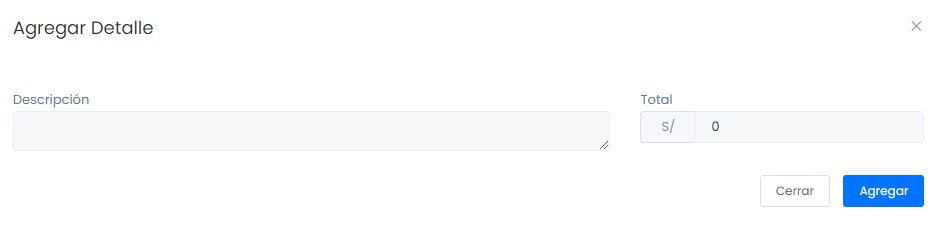
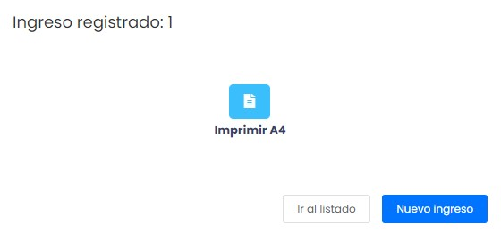

# Ingresos

En este artículo te enseñaremos a como registrar ingresos de dinero que no sea por ventas. Sigue estos pasos para realizarlo:

Ingresa al módulo de **Finanzas** y luego selecciona la subcategoría Ingresos.

## Crear Ingresos

Selecciona el botón **Nuevo** para un nuevo ingreso.

Aparecerá la siguiente formulario **Nuevo Ingreso**:

Completa los siguientes campos necesarios:

- **Tipo comprobantes:** Selecciona el tipo de comprobante que se acomode más a sus requerimientos.
- **Cliente:** Ingresa al cliente.
- **Método de ingreso:** Selecciona el método de ingreso que más se acomode a sus requerimientos.
- **Destino:** Selecciona el destino del dinero.
- **Agregar detalle:** Selecciona el botón **Agregar detalle**, aparecerá la siguiente ventana emergente.

Completa los siguientes campos:

- **Descripción:** Agrega una pequeña descripción del ingreso.
- **Total:** Ingrese el total del ingreso.

Seguido seleccione el botón **Agregar** , finalmente selecciona el botón **Generar** y su ingreso se registrará.

