# Configuración esencial para tu cuenta de facturación

En este artículo te enseñaremos los pasos esenciales para configurar tu plataforma de facturación, conectarte a SUNAT y empezar a facturar:

1. **Conectar tu cuenta con SUNAT:** Pasar de DEMO a PRODUCCIÓN.
2. **Configurar el validador de documentos.**
3. **Configuración para las guías electrónicas.**
4. **Configuración para el envió automático de boletas y facturas.**
5. **Agregar productos.**
6. **Agregar clientes.**
7. **Configurar tu establecimientos y series.**
8. **Selecciona tu plantilla PDF.**
9. **Configuración ingreso de dinero.**

## 1.  Conectar a Sunat : DEMO A PRODUCCIÓN

Este paso es necesario para poder enviar tus comprobantes y sean aceptados por SUNAT. Sigue estos pasos para realizarlo:

Ingresa al módulo de **configuración**,luego a la sección **empresa** y selecciona subcategoría **empresa**.

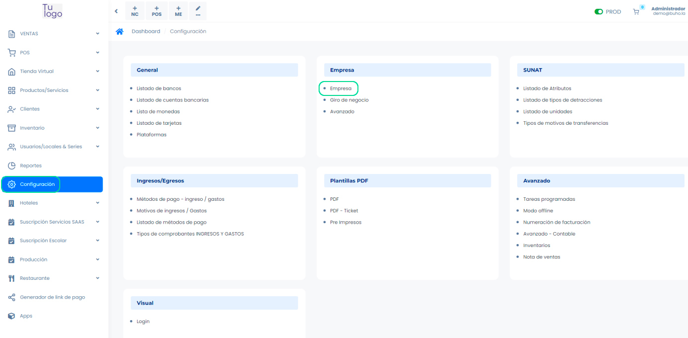

Nos dirigimos a la sección entorno de sistema, en esta sección realizaremos:

* Cambio de SOAP tipo **Demo a Producción**.
Escoger SOAP envío **Sunat**.
Colocar SOAP usuario y contraseña del **usuario secundario** creado previamente(Sigue los pasos en este **[video](https://www.youtube.com/watch?v=PZ028aDpR3A&ab_channel=DigitalBuho)**), tener en cuenta que al colocar el usuario debe agregar el RUC previamente, como la imagen indicada.

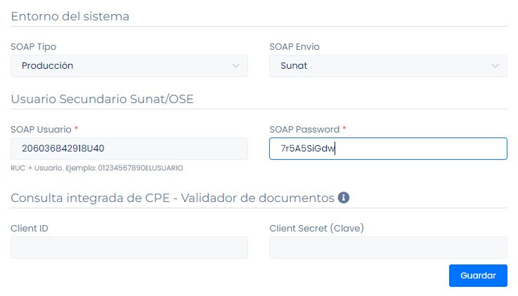

:::danger importante

* Al crear un usuario secundario no utilizar palabras que contengan parte de nombre
de la empresa.

  * Ejemplo:
    * Nombre de la Empresa: Constructora Juan.
    * Usuario Secundario: CONSJUAN (Error).
    * **Usuario Secundario: C6NSJU4N (Correcto)**.
* Al generar la contraseña secundario asegúrese de usar contraseñas que
contengan números y letras con mayúsculas, y que no usen palabras de la
empresa. Para generarla puede utilizar herramientas externas como: **[https://www.clavesegura.org/es/](https://www.clavesegura.org/es/)**

:::

Para completar la conexión con SUNAT es necesario subir el certificado digital. En esta sección adjuntamos el archivo .pfx que nos brinda SUNAT.

Para descargarlos sigue los pasos en este  **[video](https://www.youtube.com/watch?v=N8fse05yda8&ab_channel=DigitalBuho)**.

## 2. Configurar el validador de documentos

Se requiere configurar el validador de documentos para que ante cualquier eventualidad con SUNAT se puedan regularizar el estado de sus comprobantes. Sigue los pasos en este **[video](https://www.youtube.com/watch?v=6YqtOrIjaDY&t=3s&ab_channel=DigitalBuho)**. Agrega los token como en la imagen mostrada.

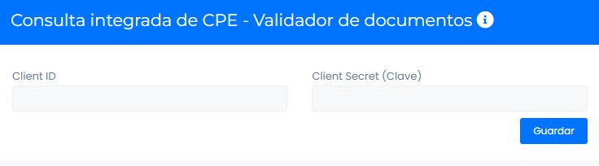

## 3. Configuración para las guías electrónicas

Este paso es necesario para poder enviar tus guías y sean aceptados por **SUNAT**. Sigue estos pasos para realizarlo:

Ingresa al módulo de **configuración**,luego a la sección **empresa** y selecciona subcategoría **empresa**.

Sigue todos los pasos en este **[artículo](https://fastura.github.io/documentacion/configuracion/Configuracion-previa-guia-remision)**.

## 4. Configuración para el envió automático de boletas y facturas a SUNAT

Este paso es necesario para que tus boletas y facturas se envíen de manera automática hacia **SUNAT**.

Ingresa al módulo **Configuración** y luego en la subcategoría Empresa, selecciona **Avanzado**.

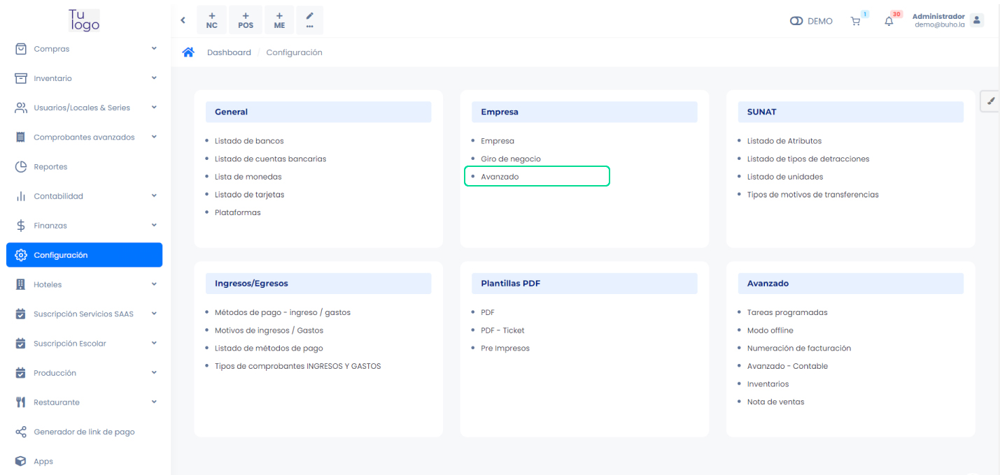

Tendrá que activar las siguientes opciones:

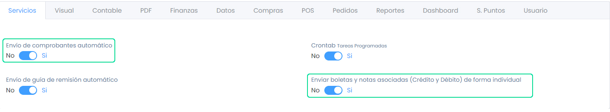

Tienen que permanecer en el **Si**.

:::info importante

Si **SUNAT** presenta alguna mala conexión en su plataforma, es recomendable desactivarla, hasta que la conexión se establezca. Una vez restablecida la conexión debe enviar sus comprobantes electrónicos de manera manual, en los tres puntos al lado derecho y selecciona **Reenviar** o también desde **Comprobantes no enviados**, selecciona el **botón azul con la flecha hacia arriba**.

:::

## 5. Como crear productos

Ingresa al módulo de **Productos/Servicios**, luego a sección **Productos**.

Existen dos maneras para agregar productos en el sistema:

* De manera individual, sigue los pasos en este **[artículo](https://fastura.github.io/documentacion/productos-servicios/Productos-Creacion-basica)**.
* De manera masiva, sigue los pasos en este **[artículo](https://fastura.github.io/documentacion/productos-servicios/Productos-Importar-masivamente)**.

## 6.  Agregar clientes

Ingresa al módulo de **Clientes**, luego a sección **Clientes**.

Existen dos maneras para agregar productos en el sistema:

* De manera individual, sigue los pasos en este **[artículo](https://fastura.github.io/documentacion/clientes/Clientes-creacion-individual)**.
* De manera masiva, sigue los pasos en este **[artículo](https://fastura.github.io/documentacion/clientes/Clientes-Importaci%C3%B3n-Masiva)**.

## 7.  Establecimientos y series

En caso de contar con más de un local o establecimiento, debe configurar las series de los comprobantes correspondientes con cada uno. Sigue estos pasos para realizarlo.

Ingresa al módulo de **Usuarios/Locales & Series**, luego a la sección Establecimientos.

Para agregar las series, los pasos están este **[artículo](https://fastura.github.io/documentacion/usuarios-locales-series/Crear-establecimiento-y-gestionar-series)**.

:::info IMPORTANTE

Si estas migrando desde otro proveedor a nuestra plataforma, para poder continuar con la numeración del correlativo de tus comprobantes,tenemos esta opción para ti:

:::

Ingresa al módulo de configuración ,luego selecciona numeración de facturación.

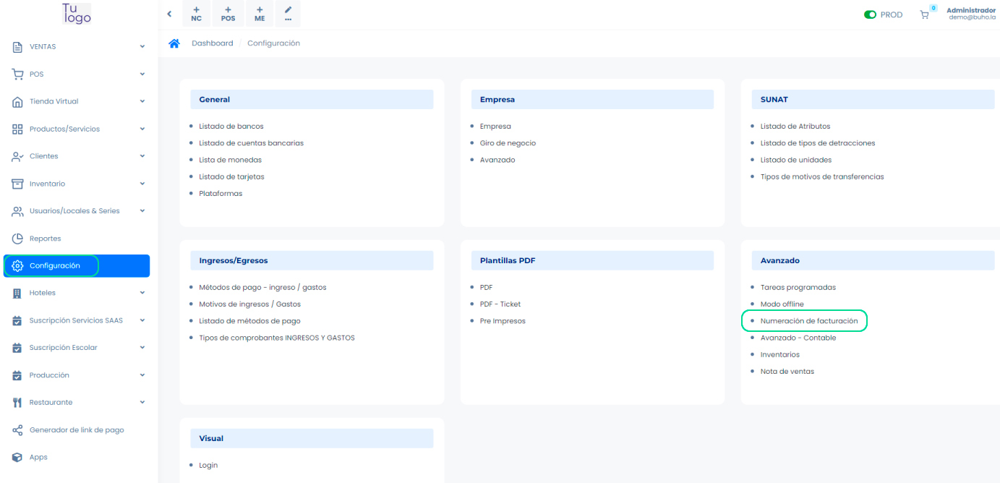

Por consiguiente seleccionamos el botón **Nuevo**, donde nos aparecerá el formulario.

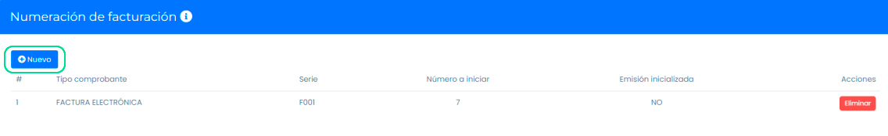

Se llenarán los siguientes datos:

* Tipo de comprobante
* Serie
* Número (Correlativo a iniciar)

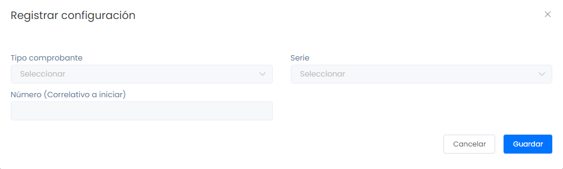

Posteriormente al **GUARDAR**, se podrá visualizar la lista de tipos de comprobantes y su **número a iniciar**.

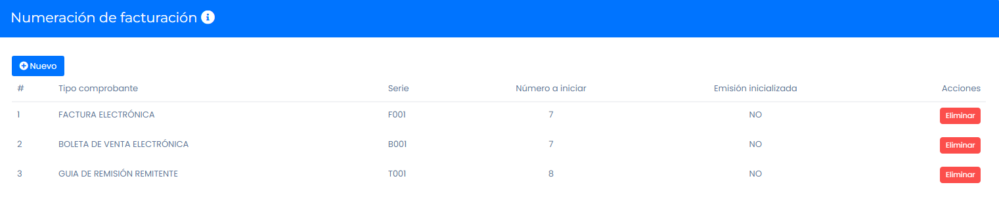

## 8. Selecciona plantilla PDF

Ingresa al módulo de configuración ,luego selecciona **PDF plantillas**. Elige la que más se adecue a tu empresa.

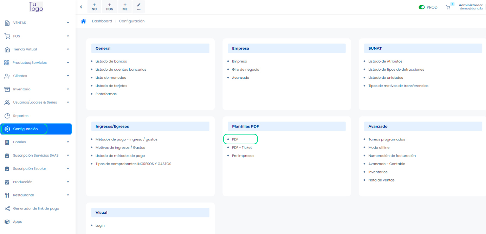

Selecciona el **establecimiento** y **activa la plantilla** que utilizará en sus comprobantes.

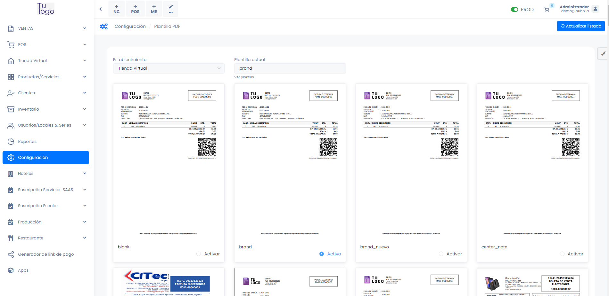

## 9. Configuración tu ingreso de dinero

Para registrar el dinero que ingresa por las ventas de tus comprobantes o registrar los gastos de tu empresa, es necesario configurar destinos de gastos o ingresos de dinero, en nuestra plataforma contamos con dos destinos:

* **Dinero en efectivo: Módulo POS**

Ingresa al módulo de **POS** ,luego selecciona **Caja chica POS**, para abrir las cajas y los reportes revisa el siguiente **[artículo](https://fastura.github.io/documentacion/pos/Abrir-una-caja-y-exportar-reportes)**.

* **Dinero en cuentas bancarias**

Ingresa al módulo de **Configuración** ,luego selecciona listas de cuentas bancarias.

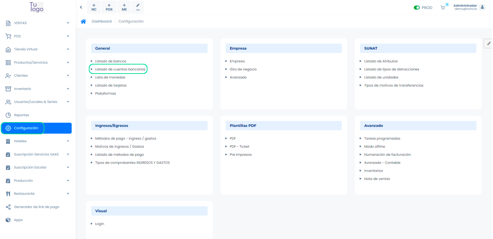

Selecciona el botón **Nuevo** donde nos aparecerá el formulario:

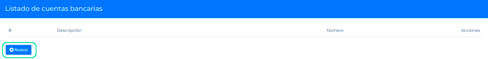

Se llenarán los siguientes datos:

* Banco
* Descripción
* Número de cuenta bancaria
* Tipo de moneda
* Número de cuenta interbancaria (CCI)
* Saldo inicial

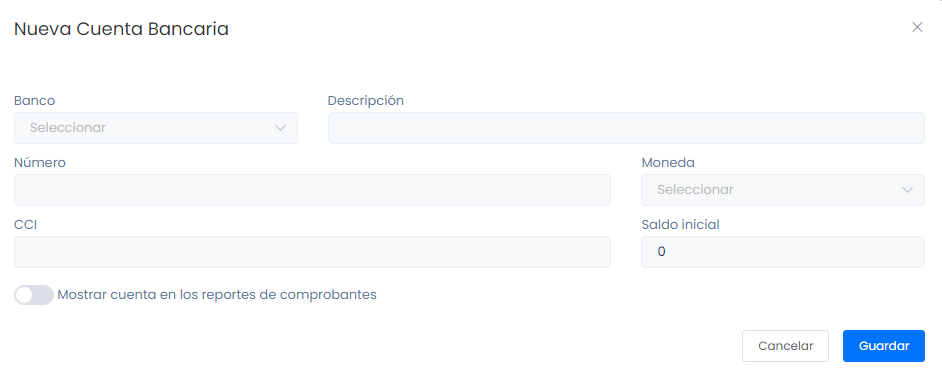

Después selecciona el botón **GUARDAR**, y se visualizará la lista de cuentas bancarias.

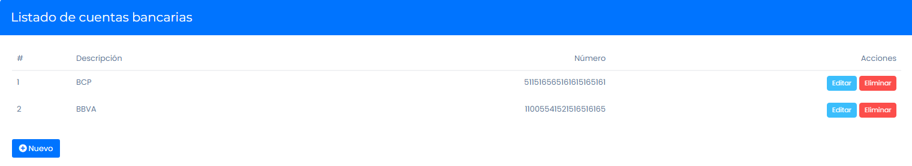
