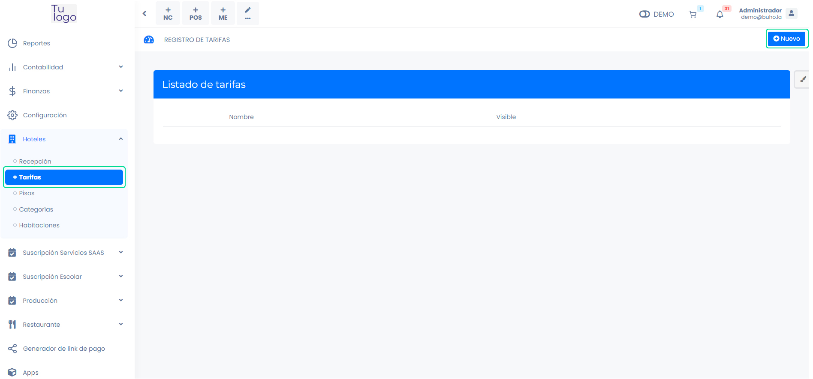
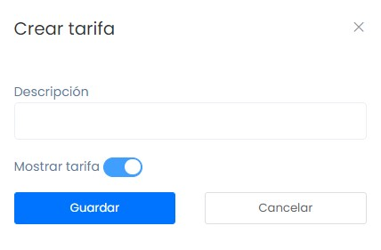
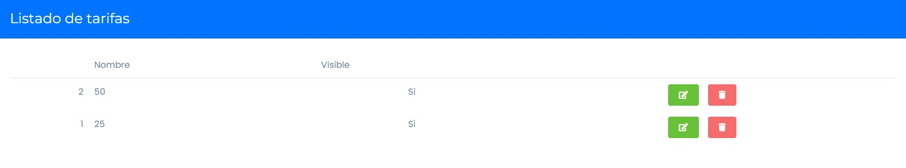

# Tarifas

En este artículo te enseñaremos a crear tarifas para tus habitaciones. Sigue estos pasos para realizarlo:

Ingresa al módulo de **Hoteles** y luego selecciona la subcategoría **Tarifas**.

## Crear tarifas

En la parte superior derecha selecciona el botón Nuevo. Aparecerá el siguiente formulario:

Completa:

* **Descripción:** Inserta la descripción de la tarifa.
* **Mostrar categoría:** Selecciona el interruptor si desea mostrar la tarifa.

Seguido selecciona el botón **Guardar**.

Se mostrará el listado de tarifas:

