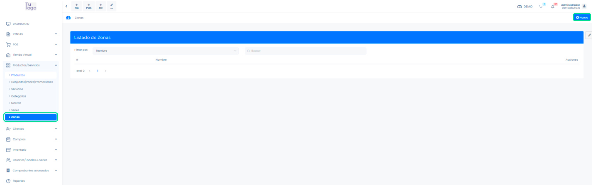
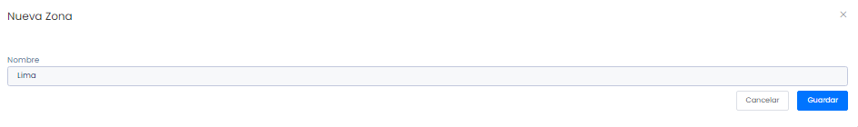
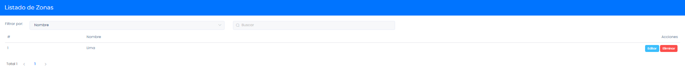

# Gestionar mis zonas

En esta área conocerá cómo crear las zonas para clasificar a  sus clientes. Sigue estos pasos para realizarlo:

## Creación de zonas

Para crear la zona, primero deberá ingresar al módulo de **Productos/Servicios** y luego selecciona la subcategoría **Zonas.**

En la parte superior derecha selecciona el botón **Nuevo.**

Posteriormente visualizará el formulario del **Nueva zona** y deberá agregar la zona correspondiente.

Después selecciona el botón **Guardar.**

## Lista de zonas

Finalmente podrá visualizar la lista de las zonas creadas. Asimismo también podrá seleccionar el botón **Eliminar** y **Editar** para cada zona.

