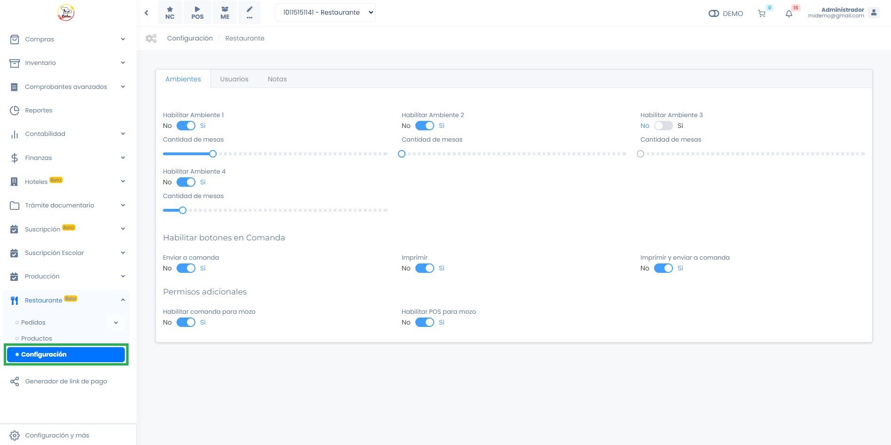
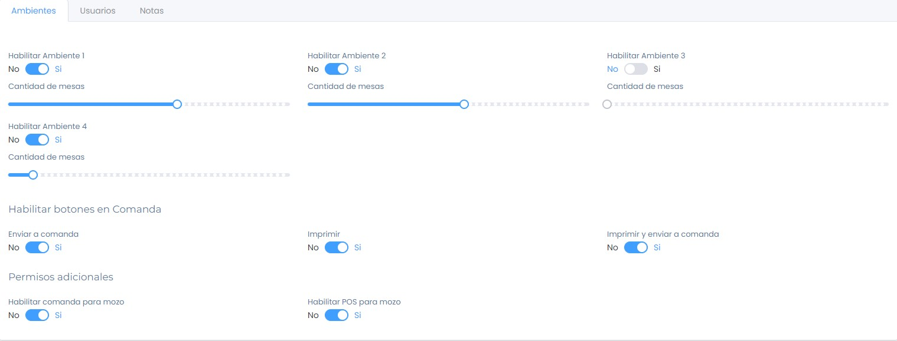
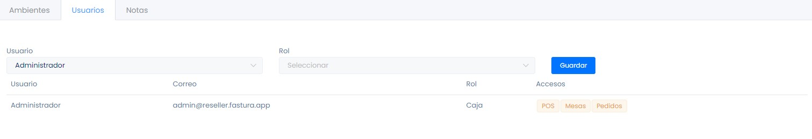
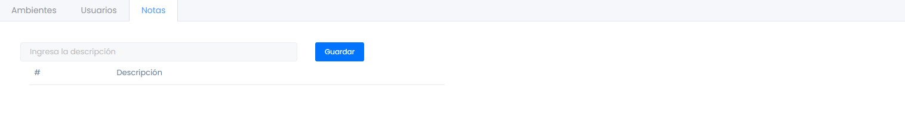
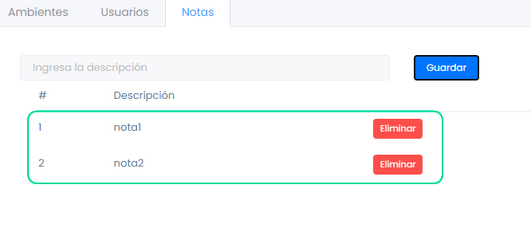
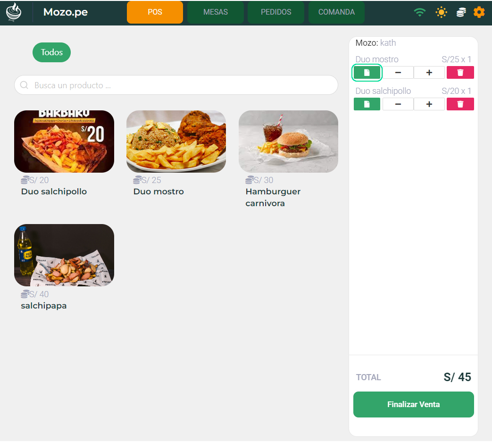

# Configuración previa

En este artículo te mostraremos cómo realizar la configuración inicial para utilizar la app **Mozo.pe**. Sigue estos sencillos pasos:

Ingresa al módulo de **Restaurante** y luego selecciona la subcategoría **Configuración.**

## Ambientes

En esta sección, puedes habilitar hasta **4 ambientes** y configurar un máximo de **50 mesas por ambiente**.

### Habilitar botones de comanda

En esta sección, puedes gestionar los permisos relacionados con la comanda. A continuación, se detallan las opciones disponibles:

- **Enviar a comanda**: Al seleccionar esta opción, el pedido tomado en mesa se enviará únicamente a la comanda.
- **Imprimir**: Esta opción permite enviar el pedido directamente a impresión, sin pasar por la comanda.
- **Imprimir y enviar a comanda**: Con esta opción, el pedido se enviará simultáneamente tanto a la cocina como a la comanda.

### Permisos adicionales

En esta sección se podrá habilitar permisos adicionales a mozo, por defecto mozo solo tiene acceso a mesa, si quieres añadirle módulos adicionales debe activar esta opción:

- **Habilitar comanda para mozo**: Con esta opción, mozo podrá ingresar a la modulo comanda.
- **Habilitar POS para mozo**: Con esta opción, mozo tendrá acceso al módulo POS

## Usuarios

En esta sección, podrás gestionar los roles y accesos de cada usuario.

Sigue estos pasos para asignar un rol:

Selecciona el usuario al que deseas asignar un rol.
A continuación, elige el rol correspondiente para el usuario, teniendo en cuenta lo siguiente:

   - **Administrador:** Este rol otorga acceso a todos los menús de Mozo.pe.
   - **Caja:** El usuario con este rol tendrá acceso a las funcionalidades de caja y todos los menús de Mozo.pe.
   - **Cocina/Bar:** Este rol permite acceso únicamente al módulo de comandas.
   - **Mozo:** Con este rol, el usuario podrá acceder a la gestión de mesas.

Finalmente, haz clic en el botón **Guardar** para aplicar los cambios.

## Notas

En esta sección, podrás agregar notas de forma sencilla.

Ingresa la descripción de la nota.

A continuación, selecciona **Guardar**. Una vez guardada, podrás ver la nota agregada en la parte inferior de la pantalla.

Estas notas se pueden añadir desde las siguientes opciones:

