# Emitir comprobantes por anticipo y su deducción

En esta área podrás crear tus comprobantes electrónicos por anticipo, en casos donde el cliente realice un pago por adelantado de un producto o servicio, también podrás realizar la deducción y llevar una mejor contabilidad.

Sigue estos pasos para realizarlo:

Ingresa al **módulo de ventas** y luego selecciona subcategoría **comprobantes electrónicos**.

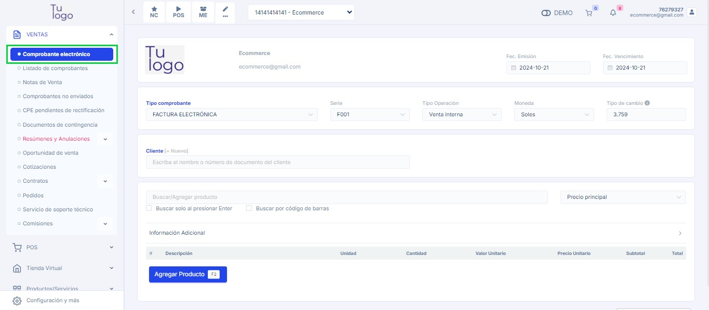

## Crear comprobante por anticipo

En esta sección te explicaremos el formulario para la creación de su comprobante electrónico por anticipo.

.jpg)

**1. Tipo de comprobante**
Se encontrará el formulario del tipo de comprobante y se completarán los siguientes datos:

- **Tipo de comprobante:** Selecciona factura o boleta electrónica
- **Moneda:** Seleccione moneda en dólares americanos o Soles
- **Fecha de emisión:** Es el día que se emite el comprobante
- **Fecha de vencimiento:** Es el día que se tiene que pagar el comprobante.

**2. Cliente**
Luego deberá escoger el cliente para la creación del comprobante, si no está creado, podrá realizarlo paso a paso en este **[artículo](https://fastura.github.io/documentacion/ventas/Emitir-comprobantes-Facturas-y-Boletas)**.

**3. Agregar producto**
Selecciona el botón **Agregar producto** y posteriormente encontrará el formulario de Agregar producto o servicio.

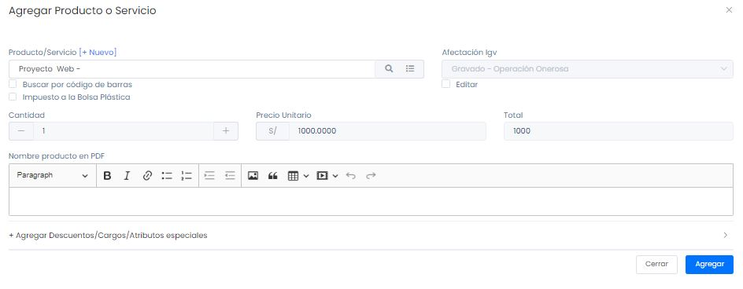

Se procederá a ingresar los siguientes datos:

- **Producto/Servicio:** Seleccione el producto creado previamente,si no está creado,podrá realizarlo paso a paso,en este **[artículo](https://fastura.github.io/documentacion/ventas/Emitir-comprobantes-Facturas-y-Boletas)**.
- **Cantidad:** Ingresa la cantidad de producto/servicio
- **Precio unitario:** Deberá colocar la **cantidad de dinero que se anticipa** o adelanta.

Después selecciona el botón **Agregar**, donde visualizará la descripción del comprobante por anticipo.

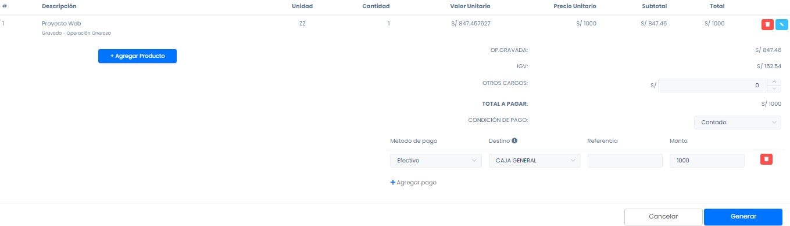

:::danger IMPORTANTE:
Recuerde que podrás generar comprobantes por anticipo las veces que usted requiere, solo realizando los mismos pasos y colocando la cantidad de dinero que se anticipa.
:::

**4. Activar botón de pago anticipado**
En esta sección se activará el botón deslizante de **¿Es un pago anticipado?**, hasta que se muestre en azul y en **deducción de los pagos anticipados** se dejará por defecto la opción **Gravado**, de tener otra afectación seleccionela.

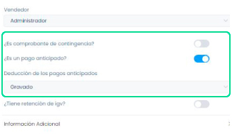

Después selecciona el botón **Generar** y  aparecerá una ventana,indicando que la factura/boleta ha sido aceptada.

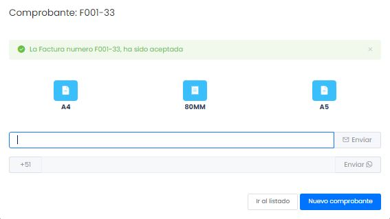

Además podrás escoger el formato del comprobante electrónico en tamaño **A4(vertical), 80MM (ticket) y A5(horizontal)**.

Asimismo puedes enviarlo por correo electrónico o WhatsApp, ingresando el dato del destinatario y seleccionando el **botón Enviar**.

Finalmente puedes seleccionar el botón  **ir al listado**, donde visualizará los comprobantes generados por anticipo,  o proceder a **crear nuevo comprobante**.

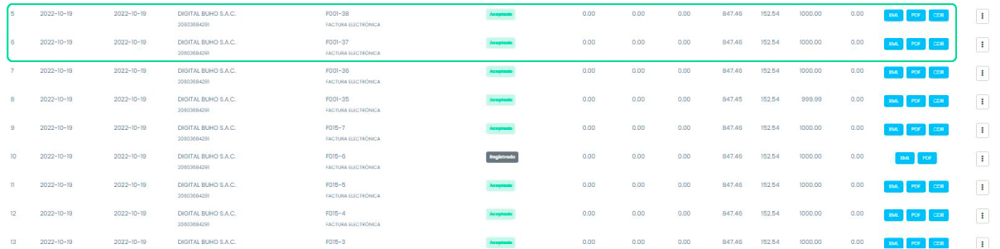

## Generar deducción

En esta sección te explicaremos paso a paso, cómo crear la **deducción de los pagos anticipados**.

.jpg)

**1. Tipo de comprobante**
Llena los campos solicitados:

- **Tipo de comprobante:** Selecciona factura o boleta electrónica
- Moneda: Selecciona la moneda en dólares americanos o Soles
- **Fecha de emisión:** Es el día que se emite el comprobante
- **Fecha de vencimiento:** Es el día que se tiene que pagar el comprobante

**2. Cliente**
Selecciona el mismo cliente que ingreso en la creación del comprobante por anticipo.

**3. Agregar producto**
Selecciona el botón **Agregar producto**,posteriormente se encontrará el formulario de Agregar Producto o Servicio.

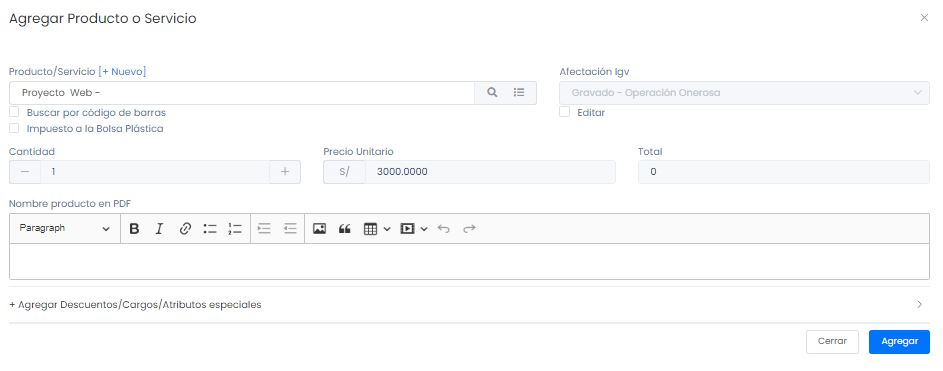

Se procederá a llenar los siguientes datos:

- **Producto/Servicio:** Ingresa el mismo producto,que se añadió en la creación de su comprobante por anticipo.
- **Cantidad:** Ingresa la cantidad de producto/servicio
- **Precio unitario:** Debe colocar el **valor total** del producto/servicio.

Después selecciona el botón **Agregar**.

**4. Activar botón deducción de pagos anticipados**
En esta sección se activará el botón deslizante de **deducción de los pagos anticipados**, hasta que se muestre en azul y en **+Agregar comprobante anticipado**,  se deben añadir los comprobantes creados previamente.

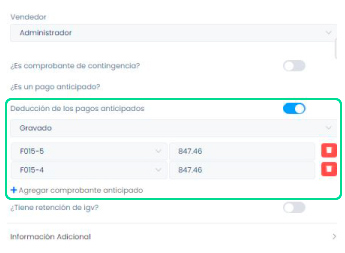

Luego visualizaremos que en la parte de descripción, se estarán añadiendo los anticipos.

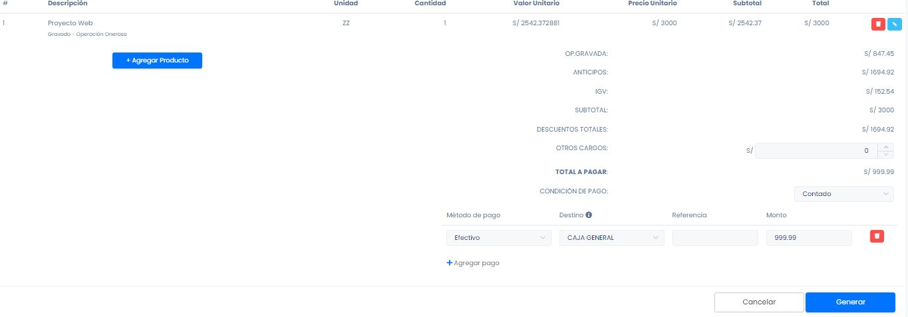

Posteriormente selecciona el botón **Generar**, y  aparecerá una ventana indicando que la factura/boleta ha sido aceptada.

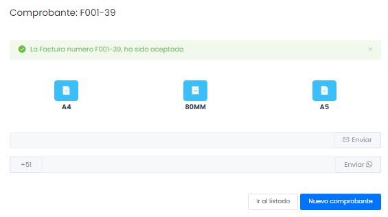

Finalmente escoge el formato y ya tendrás listo tu comprobante de deducción por pagos anticipados.

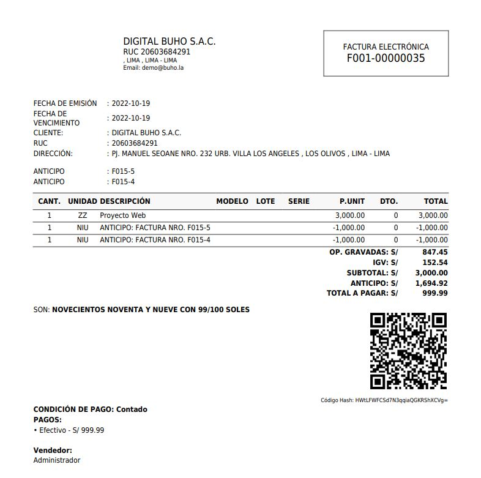

:::danger IMPORTANTE:

 Recuerda que al utilizar esta modalidad, los comprobantes que generes deben tener el mismo producto o servicio. De añadir otro alterará el cálculo final.

:::
