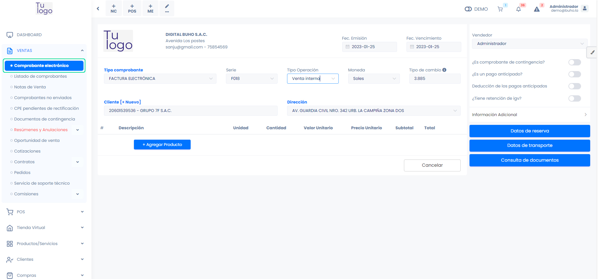
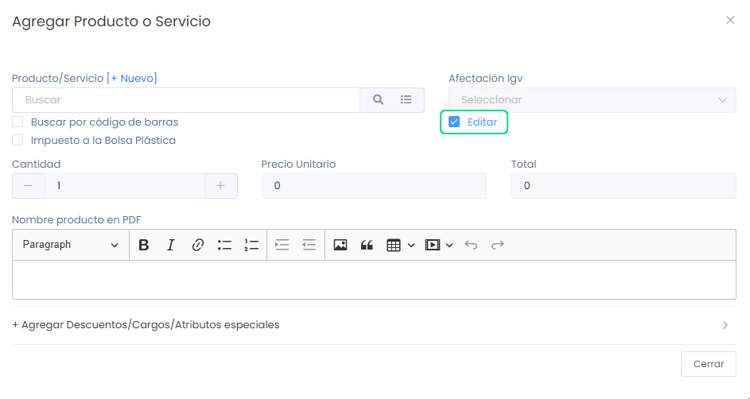

# Comprobantes Exonerados

Los comprobantes con afectación exonerada tienen un propósito claro en los ámbitos tributario y comercial. Se emplean para documentar transacciones libres de ciertos impuestos, especialmente el Impuesto General a las Ventas (IGV), conforme a las leyes fiscales. Estos comprobantes aseguran la correcta contabilización de operaciones exentas y cumplen con regulaciones tributarias.

En este artículo te enseñaremos a realizar Comprobantes con afectación Exonerada. Sigue estos pasos para realizarlo:

Ingresa al módulo de **Ventas**, y luego selecciona la subcategoría **Comprobante electrónico**. Seguido selecciona cliente y selecciona el botón **Agregar Producto**.

Seguido, aparecerá la ventana emergente para agregar Producto. Tendrá que activar la casilla de selección, que dice **Editar**, selecciona la **afectación IGV: Exonerado – Transferencia Gratuita**.

Agregue el producto y seguido Genere el comprobante, al ser de afectación exonerada, el producto que selecciono, no tendrá costo para el cliente.
