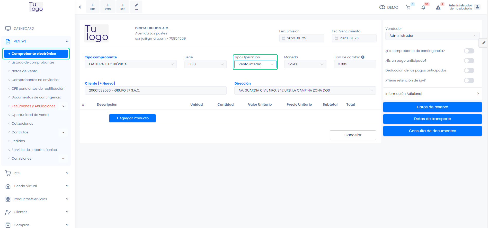
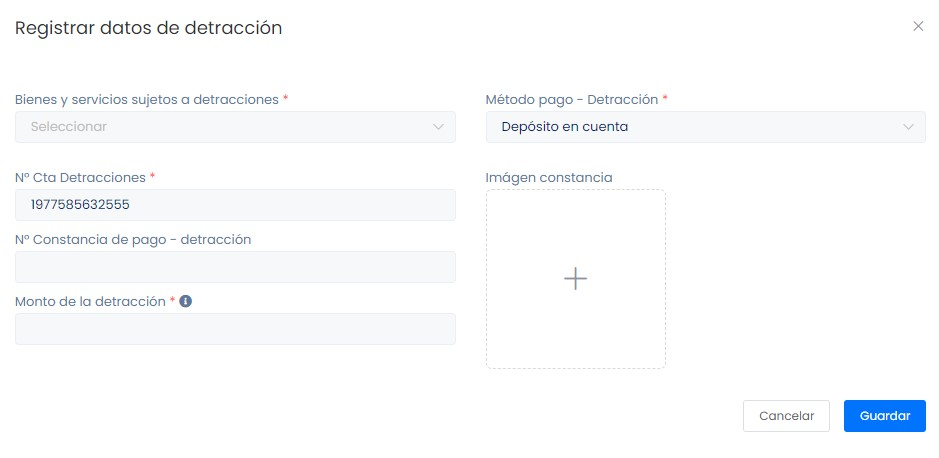
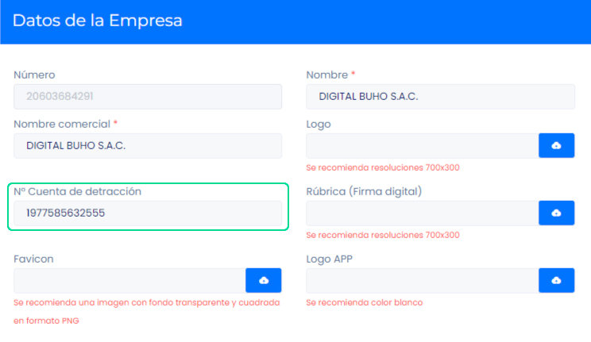

# Agente de detracción

Los documentos de agente de detracción son esenciales para respaldar y registrar transacciones sujetas a detracción. Mantienen registros precisos, facilitan la relación vendedor-comprador y aseguran la recaudación tributaria adecuada.

En este artículo te enseñaremos a realizar una venta con el **Tipo de Operación: Operación Sujeta a Detracción**.  Sigue estos pasos para realizarlo:

Ingresa al módulo de **Ventas**, y luego selecciona la subcategoría **Comprobante electrónico**. Seguido selecciona el tipo de operación para cambiarlo, te aparecerá una ventana emergente.

 Completa los siguientes datos:

- **Bienes y servicios sujetos a detracciones:** Selecciona la opción que más se acomode a sus requerimientos. Para añadir otros Bienes y servicios sujetos a detracciones, sigue este **[artículo](https://fastura.github.io/documentacion/configuracion/Sunat-Listado-de-tipos-de-detracciones)**.
- **N° Cta Detracciones:** Se requiere configuarlo, en el módulo Configuraciones, la subcategoría Empresa selecciona Empresa, en Datos de la empresa se encuentra el campo a llenar.

- **N° Constancia de pago - detracción:** Se puede adjuntar la constancia de pago de la detracción, este campo no es obligatorio.
- **Monto de la detracción:** Se calcula automaticamente en base al total del comprobante.
- **Método de pago - Detracción:** Selecciona el método de pago de la detracción. Para añadir otro método de pago, sigue este **[artículo](https://fastura.github.io/documentacion/configuracion/Ingresos-egresos-listado-de-metodos-de-pago)**.

Después de agregar el cliente y el producto respectivo, que debe ser del valor de 700 a más. Selecciona el botón **Generar**.
