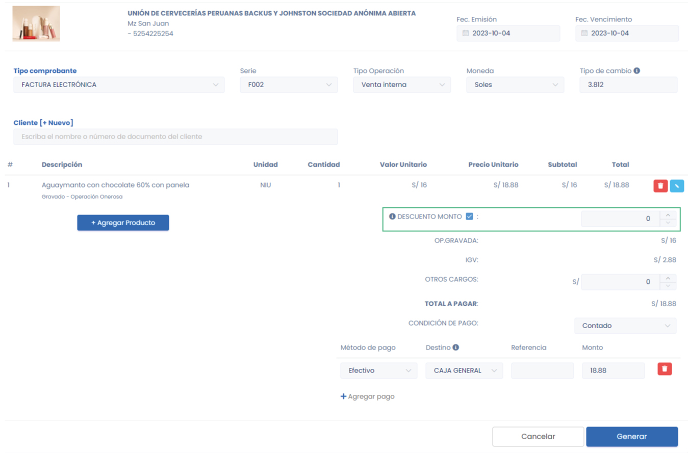

# Comprobante con Descuento Global

Los descuentos globales son reducciones de precio aplicadas a un conjunto de productos o a una transacción completa en lugar de artículos individuales, utilizados en el comercio para incentivar compras o liquidar inventario.

:::info IMPORTANTE
Es importante leer este [artículo](https://fastura.github.io/documentacion/ventas/Emitir-comprobantes-Facturas-y-Boletas) antes de seguir los siguientes pasos.
:::

Una vez ingresado todos los productos, puede activar el descuento Global, puede agregar el descuento por monto o por porcentaje.

Cuando la casilla de selección esta activa, el descuento por monto estará activado, y si esta desactivada el descuento por porcentaje se activa.

## Configuración previa

Se puede editar el Tipo de descuento global:

- Descuentos globales que afectan la base imponible del IGV/IVAP.
- Descuentos globales que no afectan la base imponible del IGV/IVAP.

:::info SUGERENCIAS:
Si la venta tiene op. gravadas utilice el descuento que afecta a la base imponible del IGV/IVAP.
Si la venta no tiene op. gravadas utilice el descuento que no afecta a la base imponible del IGV/IVAP.
:::
