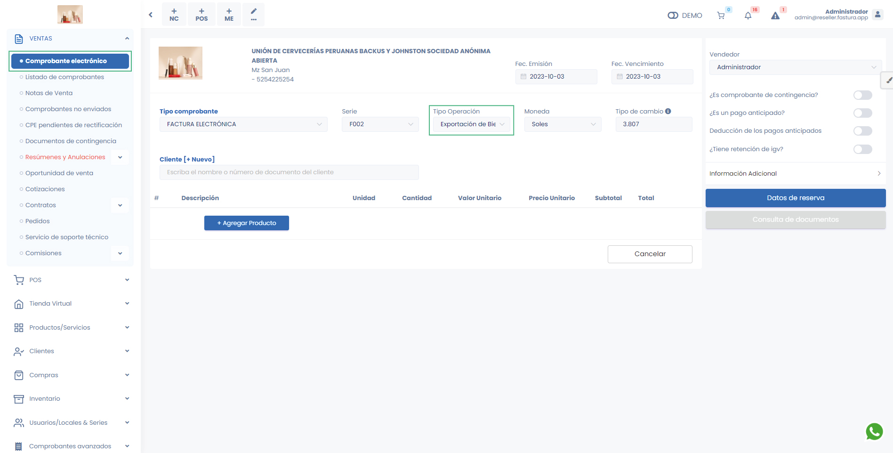
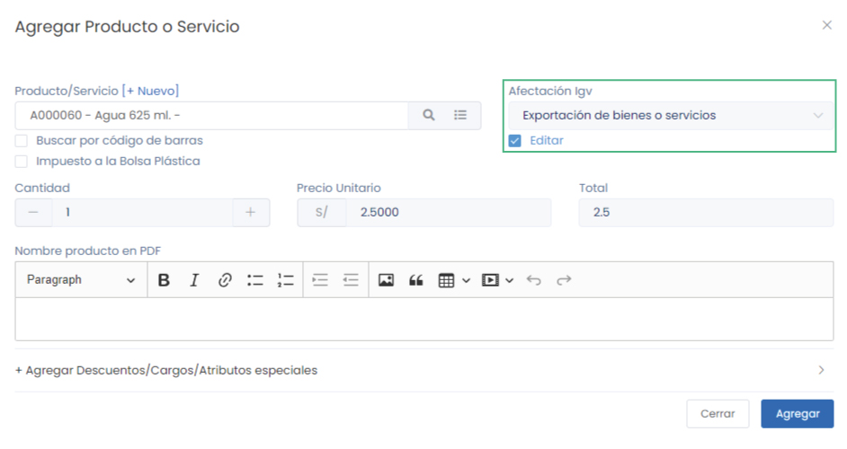

# Emitir comprobante de exportación

Un comprobante de exportación es un documento que registra la salida de mercancías de un país a otro, incluyendo información del exportador y las mercancías, es crucial para el control aduanero y fiscal en las operaciones de exportación.

:::info IMPORTANTE

Es importante leer antes este **[artículo](https://fastura.github.io/documentacion/ventas/Emitir-comprobantes-Facturas-y-Boletas)**.

:::

Ingresa al **Módulo de ventas** y luego selecciona subcategoría **Comprobantes electrónicos**, y cambiar el Tipo de operación a **Exportación de bienes**

## Seleccionar cliente

Al agregar un cliente, tiene que estar registrado con el Tipo de Doc. Identidad que no sea **RUC** ni **DNI**.

## Agregar productos

Al agregar un producto, debe editar el Tipo de afecctación IGV,  haz clic en la casilla de selección **Editar** y selecciona **Exportación de bienes**.

Una vez ingresado todos los productos, selecciona el botón **Generar**.
