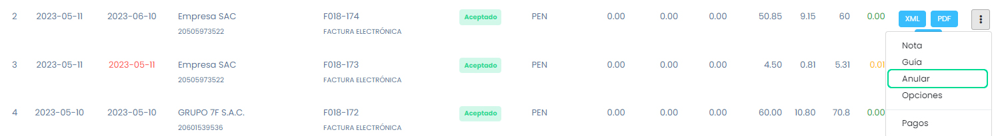
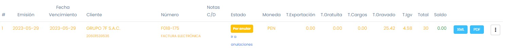
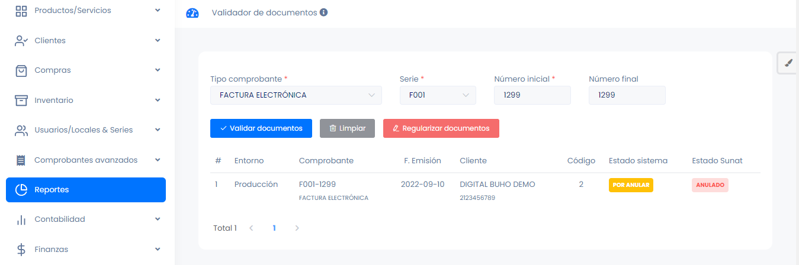
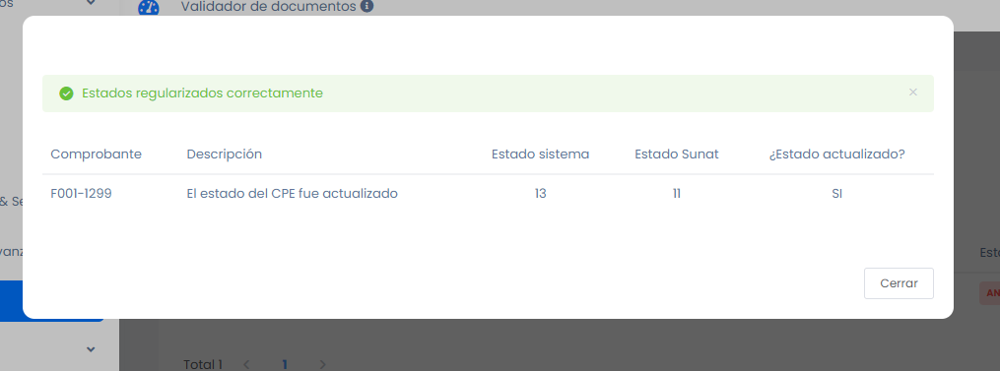
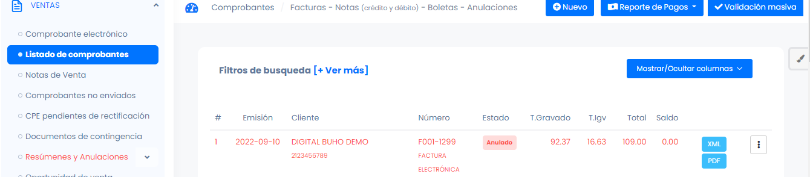

# Anulación de comprobantes Automática

Cuando se presenta la necesidad de anular un comprobante, es esencial contar con un proceso sencillo y efectivo que permita llevar a cabo esta tarea de manera precisa.

Si desea anular un comprobante lo que debe hacer es dirigirse a los 3 puntos del lado derecho y dar clic en anular, completar el motivo y clic en **ANULAR**.

Ya con estos pasos el comprobante queda anulado automáticamente y ese es el estado en SUNAT. Sin embargo en plataforma se visualizará con el estado POR ANULAR.

Para cambiar el estado y sincronizarlo con el de SUNAT, debemos dirigirnos a REPORTES - VALIDADOR DE DOCUMENTOS, y colocar el comprobante a actualizar.

Hacemos clic en REGULARIZAR DOCUMENTOS, y el estado en plataforma del comprobante quedará actualizado.

:::danger IMPORTANTE:
Recuerde que estas anulaciones solo se pueden realizar dentro de los primeros 7 días después de la emisión del comprobante, pasado el tiempo debe emitir una nota de crédito.

:::
