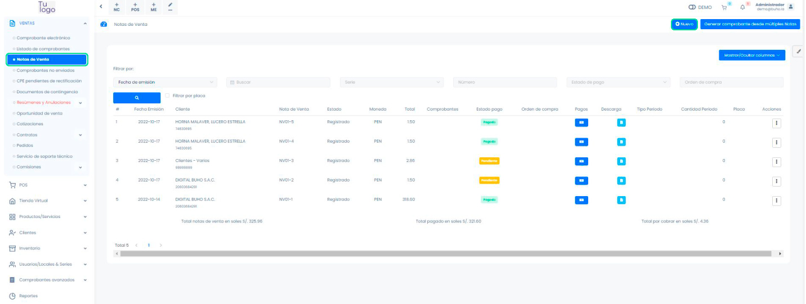
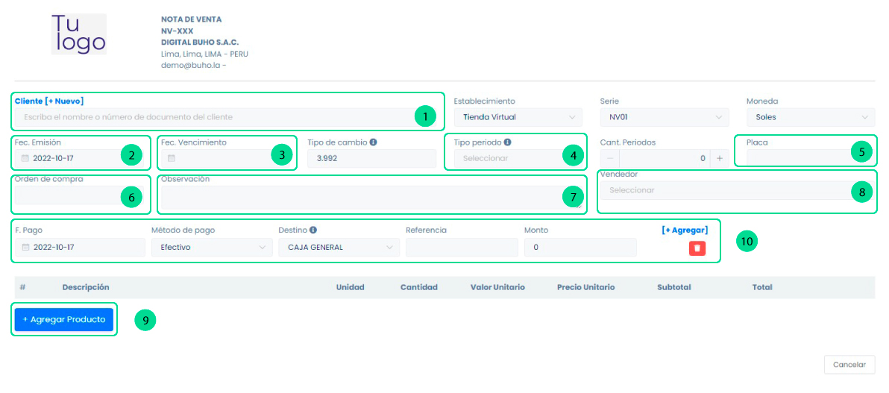
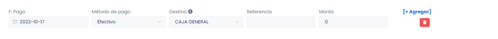
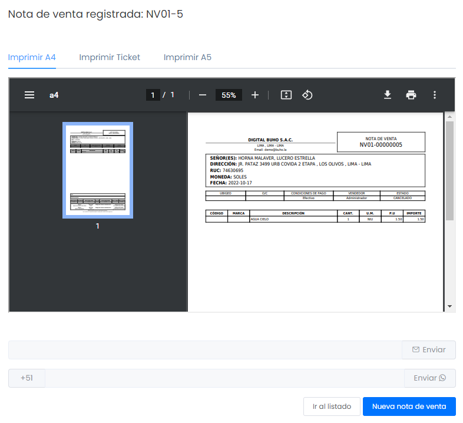

# Notas de ventas

En esta área podrás conocer como generar una nota de venta.
Ingresa al **módulo de ventas** y luego ir a subcategoría **Notas de venta**.

A primera vista aparecerá la lista de las notas, para crear una nueva nota de venta tendrá que seleccionar el botón **Nuevo**.

## Crea tu nota de venta

En esta área te explicaremos la función de cada sección enumerada.

**1. Cliente**
Luego deberá escoger el cliente para la creación del comprobante, si no está creado, podrá realizarlo paso a paso en este **[artículo](https://fastura.github.io/documentacion/ventas/Emitir-comprobantes-Facturas-y-Boletas).**

**2. Fecha de emisión**
Colocar la fecha de emisión

**3. Fecha de vencimiento**
Colocar fecha de vencimiento.

**4. Tipo periodo**
Si es un monto recurrente se selecciona si es anual o mensual, caso contrario sea un caso único no se selecciona nada.

**5. Orden de compra**
Un dato adicional, coloque aquí el número de la orden de compra en caso se requiera.

**6. Observación**
Un dato adicional, puede usarse para hacer un comentario de la empresa u otros.

**7. Vendedor**
Un dato adicional, el vendedor que realiza la nota.

**8. Agregar Producto**
Luego deberá escoger el producto para la creación del comprobante, si no está creado, podrá realizarlo paso a paso en este **[artículo](https://fastura.github.io/documentacion/ventas/Emitir-comprobantes-Facturas-y-Boletas)**.

**9. Método de pago Destino**
Selecciona el tipo de método de pago que mejor se acomode a tus requerimientos.

:::danger IMPORTANTE:
Si escogió el método crédito , podrá visualizar el detalle de su comprobante ingresando a módulo de finanzas y en la sección cuentas por cobrar.
:::

Una vez llenado todos los campos requeridos, seleccionamos el botón Generar. Nos aparecerá una ventana con el comprobante virtual. Podrá seleccionar en qué formato imprimirlo y si desea podrá enviarlo por correo electrónico o por medio de whatsapp.

