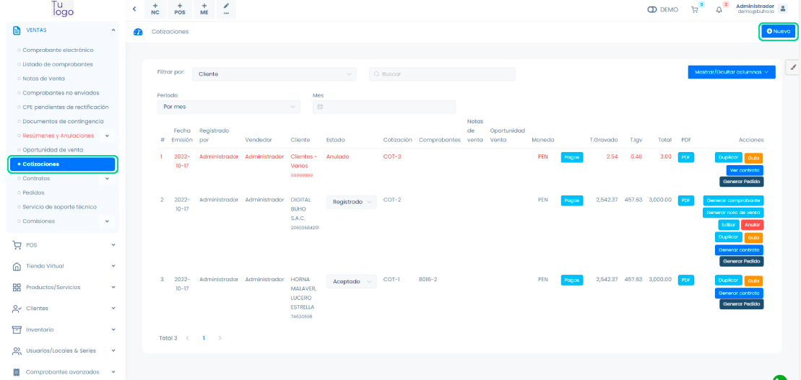
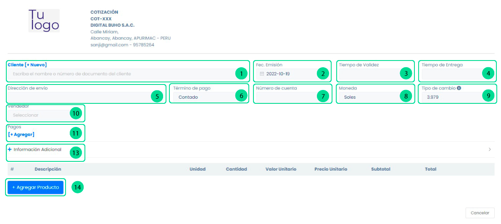
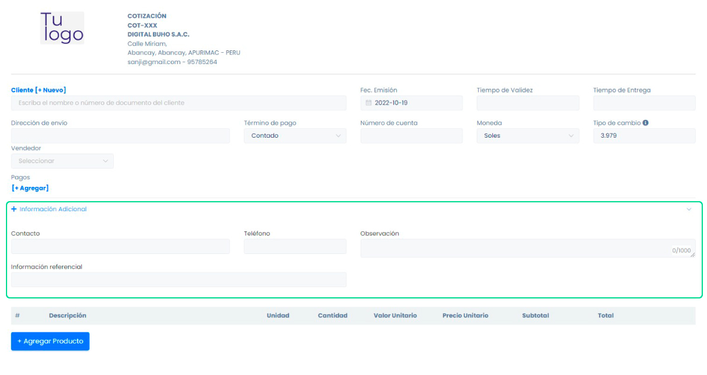
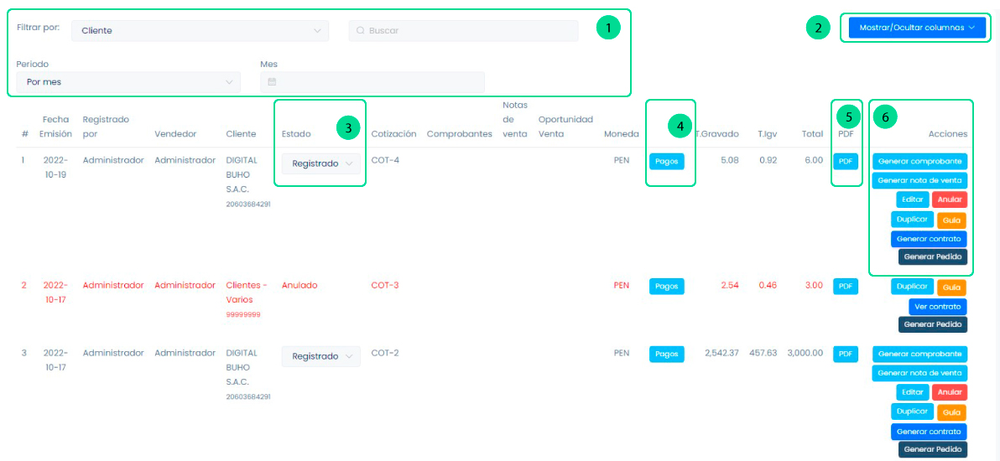
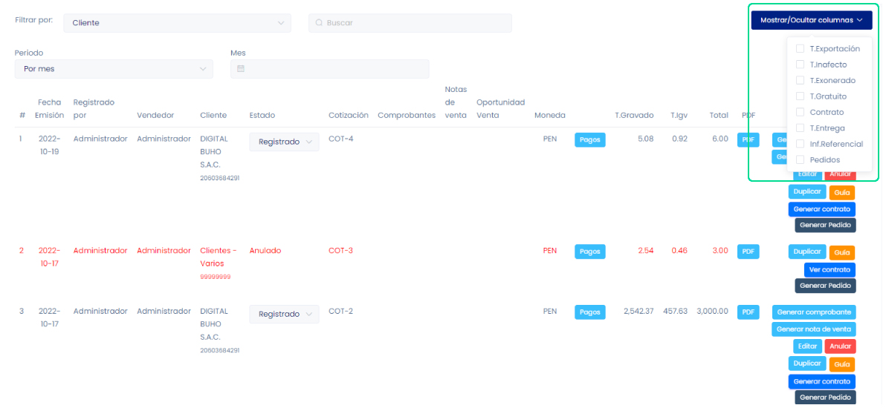
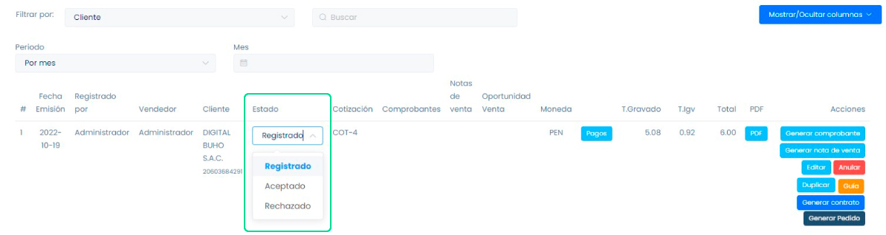
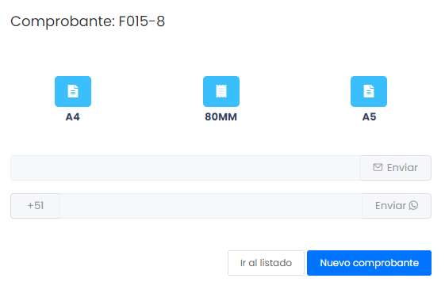
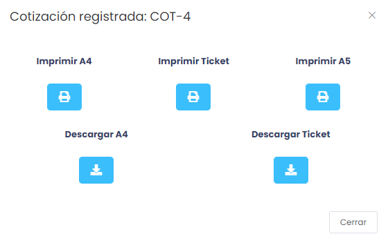

# Documentos pre - venta: Cotizaciones

Una cotización es una oferta de precios en la cual se especifican las condiciones, como el tiempo de validez, el tiempo de entrega y los términos de pago.

En esta área podrás generar comprobantes de cotizaciones.Sigue estos pasos para realizarlo:

Ingresa al módulo de **Ventas** y luego selecciona la subcategoría Cotizaciones.En la parte superior derecha selecciona el botón **Nuevo**.

## Generar cotización

**1. Cliente:** Luego deberá escoger el cliente para la creación del comprobante, si no está creado, podrá realizarlo paso a paso en este **[artículo](https://fastura.github.io/documentacion/ventas/Emitir-comprobantes-Facturas-y-Boletas)**.

**2. Fec. Emisión:** La fecha en la que se realiza la cotización.

**3. Tiempo de Validez:** Una referencia al tiempo que dura la cotización generada.

**4. Tiempo de Entrega:** Una referencia de cuando se realizará la entrega del producto o el servicio.

**5. Dirección de envío:** Se autocompletará con la dirección adicional del cliente seleccionado.

**6. Término de pago:** Seleccione el tipo de condición de pago que mejor se acomode a tus requerimientos.

**7. Número de cuenta:** Inserte su número de cuenta donde desee que le depositen el dinero.

**8. Moneda:** Podrá seleccionar si desea el pago sea en dólares o soles.

**9. Tipo de cambio:** El tipo de cambio varía según la SUNAT.

**10. Vendedor:** El vendedor que se está realizando la cotización.

**11. Pagos:** En caso el cliente quisiera hacer un adelanto al monto de la cotización.

**13. Información Adicional:** En esta área podrá  agregar información adicional de la cotización.

**14. Agregar productos:** Luego deberá escoger el producto para la creación de la cotización, si no está creado, podrá realizarlo paso a paso en este **[artículo](https://fastura.github.io/documentacion/ventas/Emitir-comprobantes-Facturas-y-Boletas)**.

Después selecciona el botón Generar y aparecerá una ventana,indicando que la cotización ha sido aceptada.

.png)

Además podrás escoger el formato de la cotización en tamaño **A4(vertical), 80MM (ticket) y A5(horizontal)**.

Asimismo puedes enviarlo por correo electrónico o WhatsApp, ingresando el dato del destinatario y seleccionando el **botón Enviar**.

Finalmente puedes seleccionar el botón  ir al listado, donde visualizará las cotizaciones generadas,  o proceder **una nueva cotización**.

## Listado de cotizaciones

En esta área observará todas las cotizaciones que realizó.

**1. Filtros de búsqueda:** En esta área podrá buscar una cotización específica.

**Filtrar por:** Para encontrar una cotización de una manera más rápida puede filtrar la búsqueda con los siguientes datos.

- Cliente

- Fecha de emisión

- Fecha de entrega

- Registrado por

- Vendedor

- Inf.Referencial

- Número

**Buscar:**En esta área escribimos el nombre del dato que seleccionamos en la anterior casilla.

**Periodo:** Para observar las cotizaciones con fechas específicas:

- Por mes

- Por semana

- Entre fechas

**Seleccione fecha:** La siguiente casilla es para seleccionar la fecha según el periodo que escogimos.

**2. Mostrar/Ocultar columnas**
En esta área podrás modificar la tabla que te aparece por defecto; se pueden añadir por columnas.

**3. Estado**

Para tener un orden con todas las cotizaciones generadas. Se puede seleccionar:

- Registrado

- Aceptado

- Rechazado

**4. Pagos**
Al seleccionar el botón aparecerá una ventana para añadir un pago a la cotización realizada.

**5. PDF**
En esta sección podrás reimprimir la cotización, de la misma manera podrá descargar la cotización. Además podrás escoger el formato de la cotización en tamaño **A4(vertical), 80MM (ticket) y A5(horizontal)**.

**6. Botones de Acción**
Se encontrará una sección de botones, con las siguientes funciones

- **Generar comprobante:** Genera  un comprobante electrónico (Factura o Boleta).

- **Generar nota de venta:** Genera una nota de venta.

- **Editar:** Podrá editar la cotización.

- **Anular:** Podrá anular la cotización.

- **Duplicar:** Podrá duplicar la cotización.

- **Guía:** Genera una guía.

- **Generar contrato:** Podrá generar contrato de la cotización, podrá realizarlo paso a paso en este **[artículo](https://fastura.github.io/documentacion/ventas/Documentos-pre-venta-Contratos).**
- **Generar Pedido:** Podrá generar pedido,podrá realizarlo paso a paso en este **[artículo](https://fastura.github.io/documentacion/ventas/Documentos-pre-venta-Pedidos)**.
