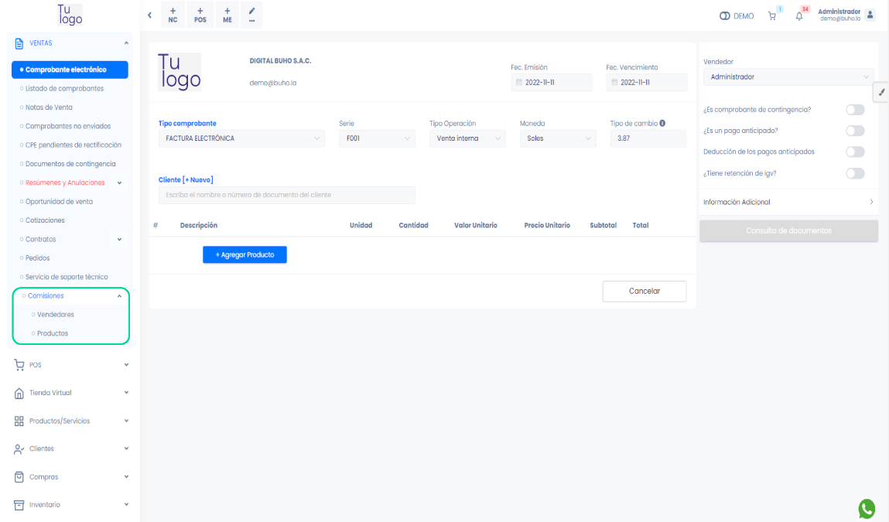
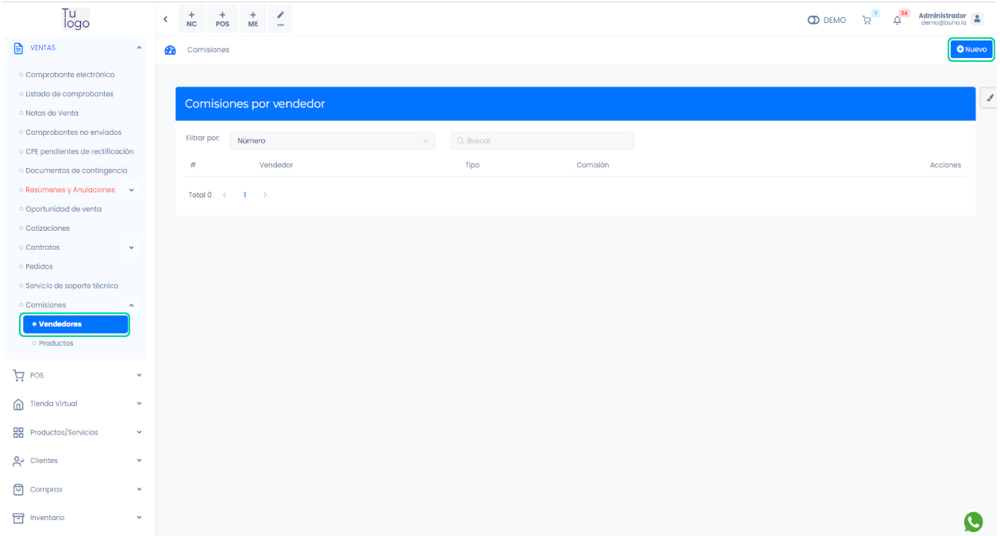
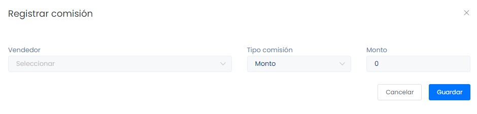
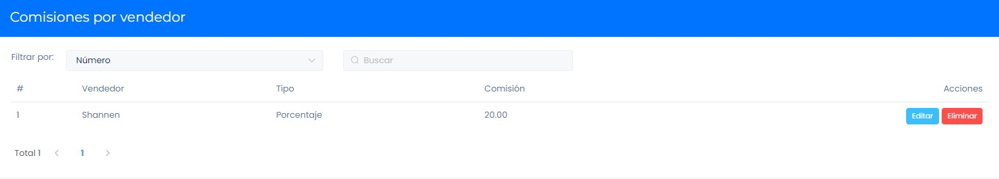
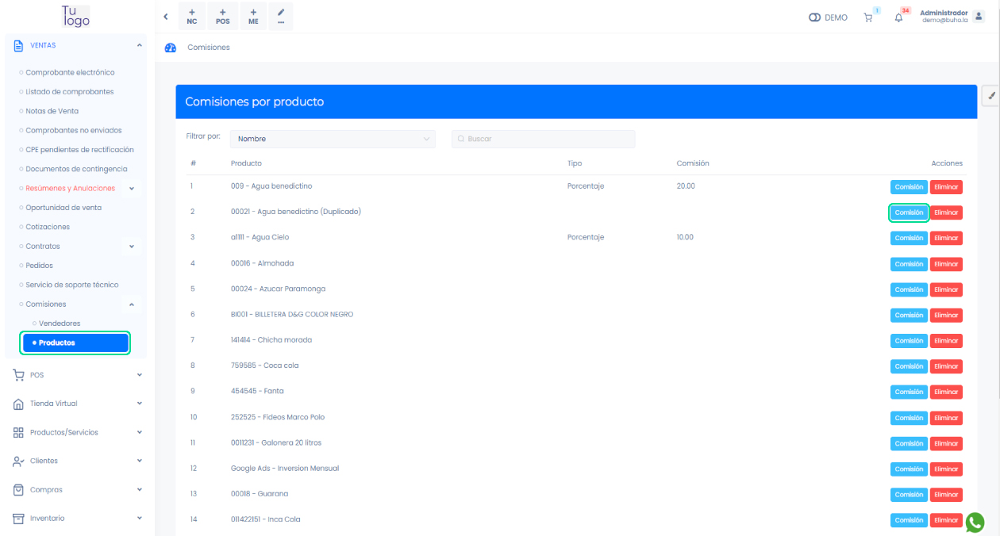
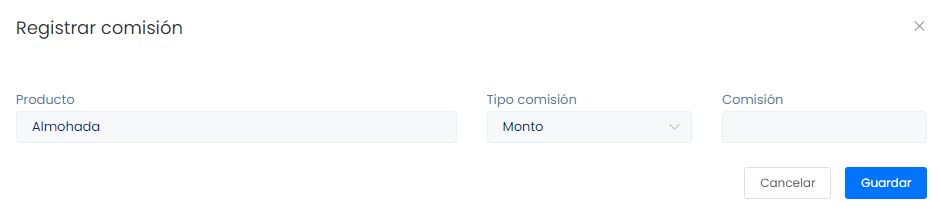
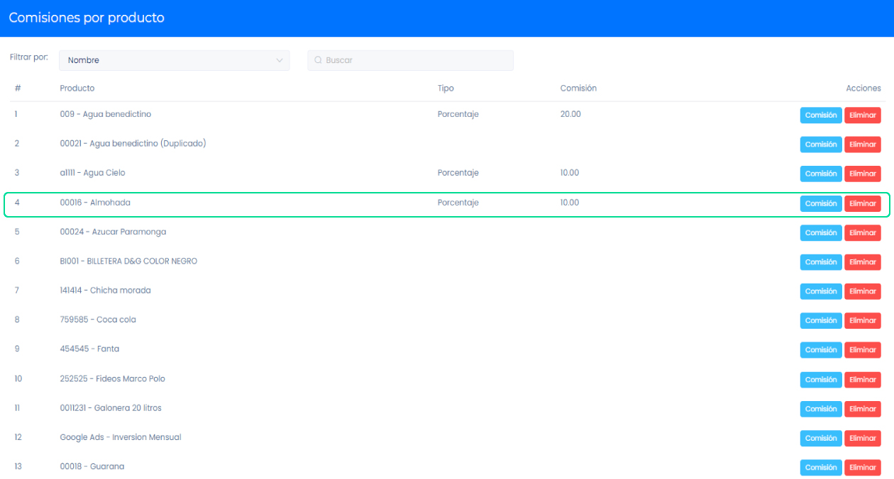
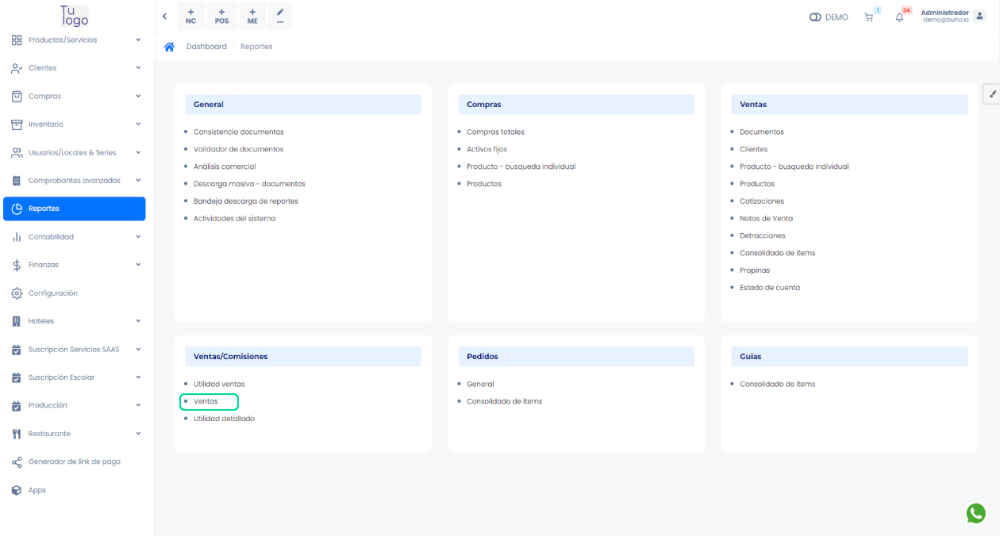
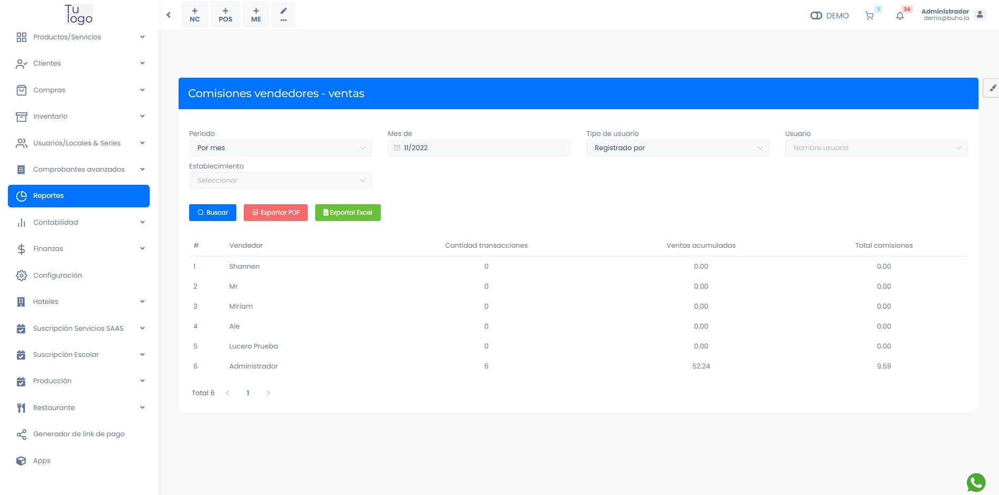

# Comisiones

Las comisiones son pagos adicionales o porcentajes que se aplican a ventas o servicios con el propósito de recompensar a vendedores específicos. Estos pagos extra se utilizan para premiar a los vendedores y motivar a los empleados a alcanzar metas establecidas.

En esta área podrás administrar las comisiones de los vendedores y productos. Sigue estos pasos para realizarlo:

Ingresa al módulo de **Ventas** y luego selecciona la subcategoría Comisiones. Donde podrá elegir **Vendedores y Productos**.

## Vendedores

Para crear un nuevo vendedor que genere comisiones seleccione el **botón Nuevo** en la parte superior derecha.

Al seleccionar aparecerá una ventana **Registrar comisión** donde tendrá que llenar los siguientes datos:

- **Vendedor:** Seleccione el vendedor que generará comisión.
- **Tipo de comisión:** Seleccione si la comisión que generará el vendedor, será por monto o porcentaje.
- **Monto:** Según lo seleccionado anteriormente, ingrese el monto o porcentaje de la comisión.
Después de rellenar todos los campos seleccionamos el **botón Guardar**.

Podrá visualizar el vendedor ya registrado.

## Productos

Al seleccionar Productos, aparecerá la lista de todos sus productos. Para añadir comisiones a los productos debe seleccionar el **botón Comisión**.

Al seleccionar aparecerá una ventana Registrar comisión donde tendrá que llenar los siguientes datos:

- **Producto:** Este campo se autocompleta según el producto que eligió.
- **Tipo de comisión:** Seleccione si la comisión que generará el vendedor, será por monto o porcentaje.
- **Comisión:** Según lo seleccionado anteriormente, ingrese el monto o porcentaje de la comisión.

Después de rellenar todos los campos seleccionamos el **botón Guardar**.

Podrá visualizar su producto con la comisión ya generada.

Para visualizar los reportes, ingresa al módulo de **Reportes** y luego la subcategoría **Ventas/Comisiones** y seleccione **Ventas**.

Podrá visualizar la lista de los vendedores y cuanto de comisión generó hasta el momento.

:::danger IMPORTANTE:

- El vendedor y el producto tienen que tener activado la comisión; no genera comisión si uno de los dos no tiene.
- Contabiliza la comisión del producto, así sea menor o mayor que el porcentaje del vendedor.

:::
