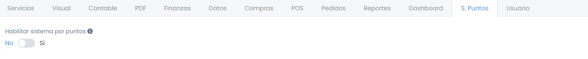
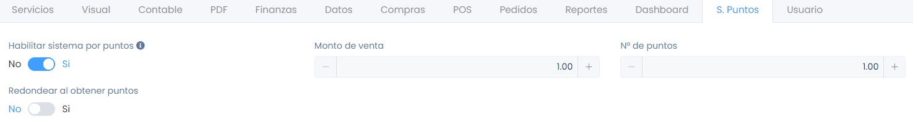
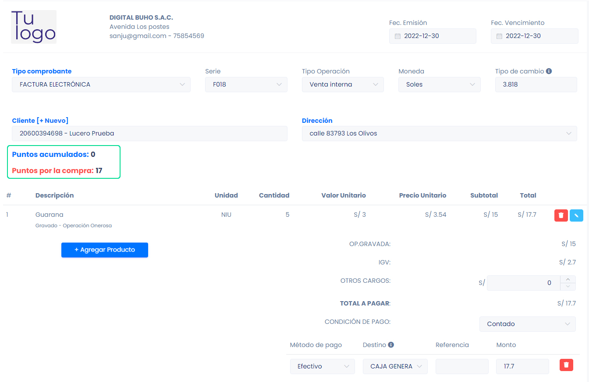
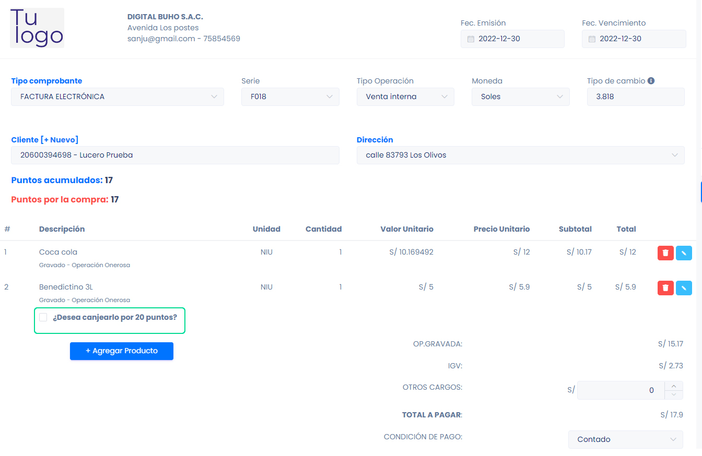

# Como acumular puntos por compras y canjear

Los puntos son un sistema de recompensas o incentivos utilizado en varios contextos, siendo uno de ellos generar lealtad en los clientes. Los puntos acumulados pueden canjearse por recompensas específicas o productos.

En este artículo te enseñaremos a conocer como se realiza el proceso de acumulación y canje de puntos por un producto. Sigue estos pasos para realizarlo:

## 1. Configuración previa para acumular puntos

Ingresa al módulo de **Configuración** y luego en la subcategoría **S. Puntos**.

Una vez dentro, debemos de Habilitar el sistema por puntos, cambiando el interruptor a **Si.**

- **Monto de venta:**  Inserta el monto de venta con el que desea que acumulen puntos.
- **N° de puntos:** Inserta el número de puntos que acumulara según el monto de venta.
- **Redondear al obtener puntos:** Si desea redondear los puntos que se acumulo.

## 2. Agregar que productos el cliente podrá canjear con los puntos

Ingresa al módulo **Productos/Servicios**, si el producto ya esta creado selecciona editar; selecciona la casilla de selección **¿Se puede canjear por puntos?**, seguido inserta con cuantos puntos se canjeará el producto.

## 3. Acumula puntos

El cliente puede acumular puntos según sus compras, en este ejemplo pusimos que por cada 1 sol de compra, el cliente obtendrá 1 punto. Entonces generamos el comprobante electrónico:

Como puede observar en la imagen, el cliente no tenia ningún punto acumulado, pero con esta compra el cliente ganará 17 puntos.

## 4. Canjear puntos

Al momento de agregar el producto previamente configurado para canjear por puntos, te aparecerá una casilla de selección para canjear por puntos, selecciónala para que el cliente pueda canjear los puntos que tiene acumulado.

Al generar ese comprobante, en el comprobante electrónico aparecerá el producto canjeado por puntos, y cuantos puntos uso.
