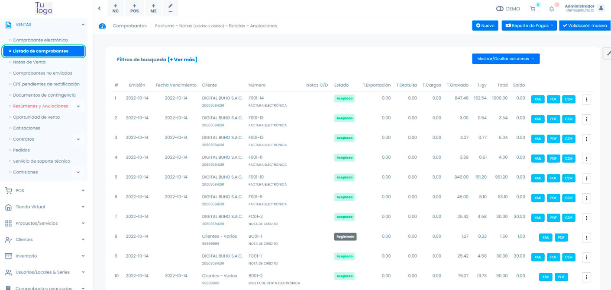
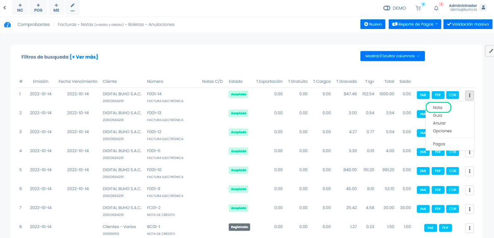
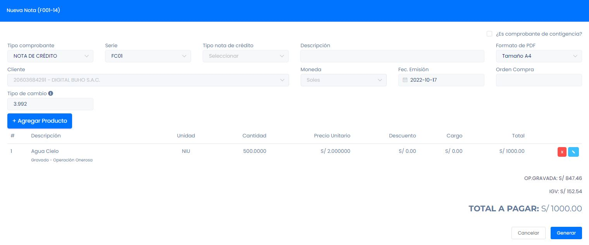
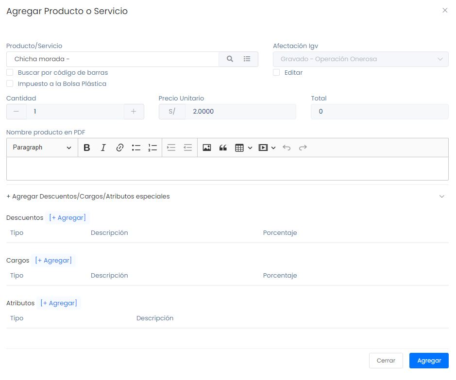

# Emitir notas de crédito y débito

En esta artículo podrás conocer como generar una nota de crédito o débito, según sea la necesidad.

Ingresa al **módulo de ventas** y luego ir a subcategoría **Listado de Comprobantes**.

:::danger IMPORTANTE:
El plazo para comunicar de baja o anular directamente un comprobante de pago electrónico es de 7 días, contados desde el día que emites el comprobante. Luego de ese plazo es necesario realizar una nota de crédito para anular cualquier comprobante.
:::

Luego selecciona los tres puntos verticales en la parte derecha y después ingresa a la sección **Nota**.

## Nota de crédito

Son documentos que el vendedor **emite** para indicarle al cliente que tiene un saldo a su favor, como lo es acreditar la devolución de un valor determinado o para que la empresa pueda corregir errores en las facturas ya emitidas de una forma sencilla.

## Nota de débito

Una **nota de débito** es un documento emitido por un vendedor a un comprador para notificarle las obligaciones de deuda en curso.

Los campos más importantes a llenar en ambos formularios,son los siguientes:

- **Tipo comprobante:** Seleccionar el tipo de comprobante.
- **Tipo de nota de crédito/débito:** Seleccione el motivo que más se amolde a su caso.
- **Descripción:** Ingresar a detalle el problema sucedido.

En caso el motivo sea modificar la cantidad del monto, cantidad del producto o agregar uno nuevo. Selecciona el botón **Agregar producto** y posteriormente se encontrará el formulario para realizar estas acciones.

Se procederá a ingresar los siguientes datos:

- **Producto/Servicio:** Si el producto se creó previamente, se visualizará en la lista de opciones,si no lo está,podrá crear el producto paso a paso en nuestro **[artículo](https://fastura.github.io/documentacion/ventas/Emitir-comprobantes-Facturas-y-Boletas)**.
- **Cantidad:** Ingresa la cantidad de productos
- **Precio unitario:** Indicará el monto de la nota.
- **Nombre del producto en PDF:** Ingresa la descripción del producto
- **Agrega descuentos,cargos o Atributos especiales.**

Después selecciona el botón **Guardar**, donde visualizará la descripción del comprobante.

Finalmente selecciona el botón **Generar**, para visualizar la nota creada.
