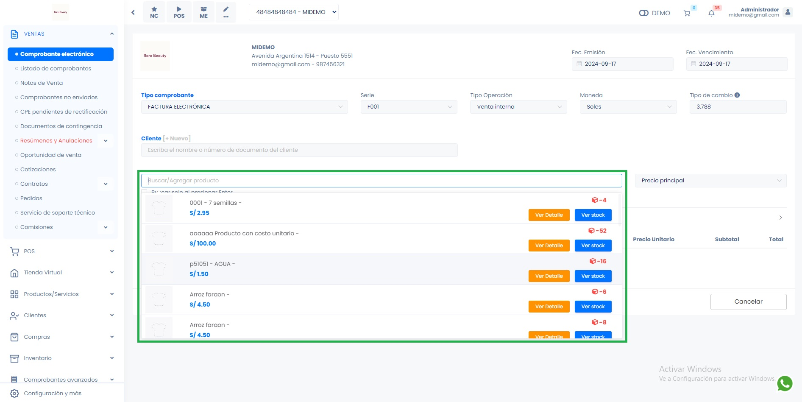
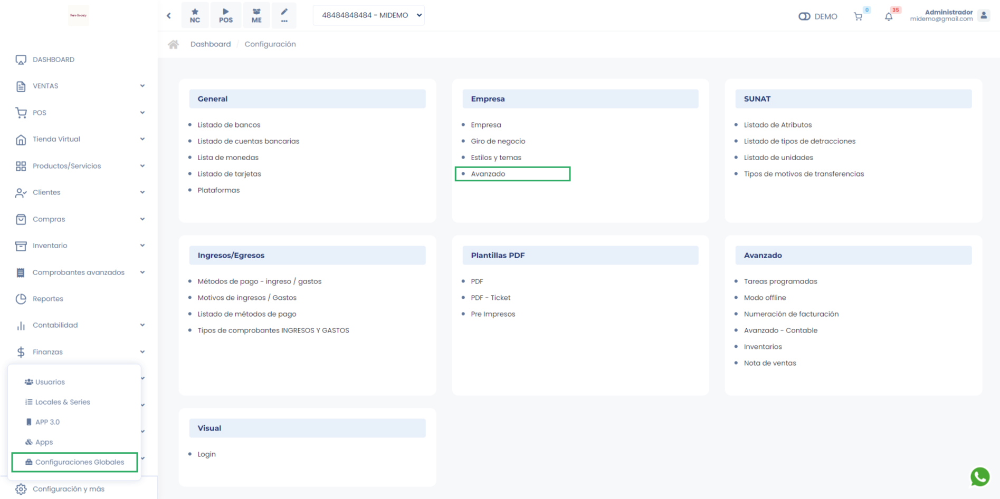

# Venta rápida

La funcionalidad de Venta Rápida te permitirá agilizar tus transacciones, reduciendo el tiempo necesario para generar los comprobantes y, como resultado, aumentar tus ventas.

### Visualización de Información del Producto

En la **Venta Rápida**, se mostrará toda la información necesaria para concretar la venta de un producto. Esto incluye:

- **Código interno**: Identificador único del producto.
- **Nombre**: El nombre del producto para facilitar su identificación.
- **Precio**: El precio del producto que se aplicará en la transacción.
- **Imagen del producto**: Una vista visual del artículo que ayudará en su reconocimiento rápido.

## Pasos para Activar la Venta Rápida

Sigue los pasos a continuación para activar la opción de venta rápida en tu sistema:

1. Accede a **Configuraciones**.
2. Dirígete a **Configuraciones y más**, y luego selecciona **Avanzado**.

3. Haz clic en la opción **Visual**.
4. Activa la opción **Buscar/Agregar productos en formulario principal**.

## Beneficios de la Venta Rápida

Una vez activada esta funcionalidad, podrás seleccionar los productos de manera más rápida desde el formulario principal, facilitando el proceso de venta y mejorando la eficiencia en la atención al cliente.

:::info

En este tipo de venta, no se podrá agregar series, descuentos u otros, si cuenta con alguno de ellos tendra que realizarlo desde **Agregar Producto**

:::