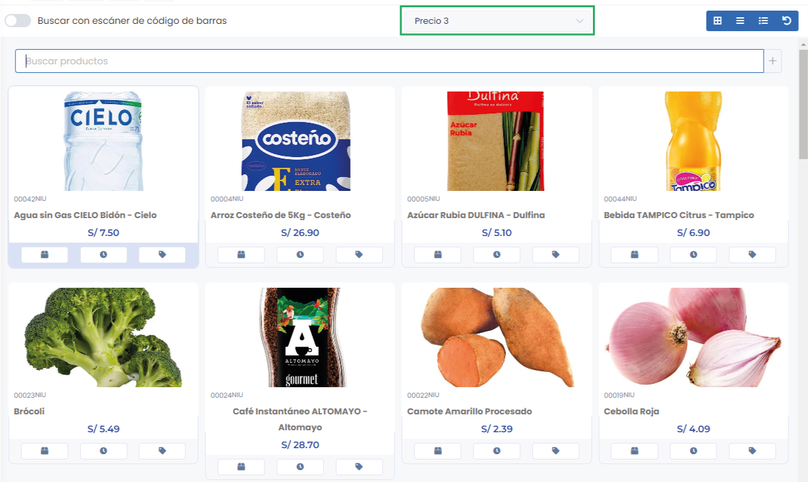
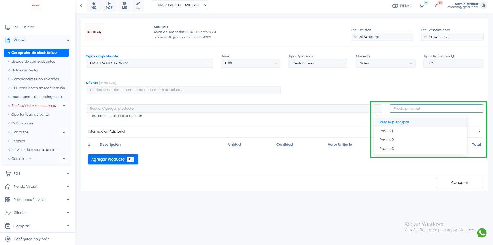
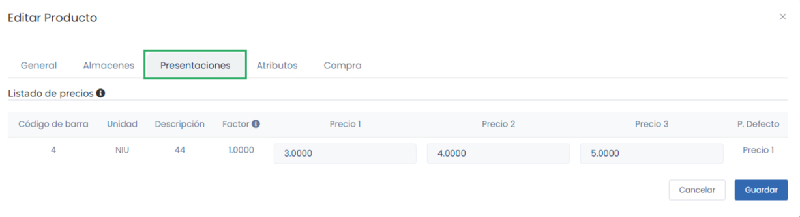

# Múltiples listas de precios por producto

Esta funcionalidad te permite gestionar hasta **tres precios adicionales** además del precio principal para un producto. Es ideal para empresas que necesitan ofrecer diferentes precios en función de condiciones específicas como clientes, volúmenes o promociones.

## Punto de Venta (POS)

El selector de precios se encuentra en el **panel lateral derecho** del sistema de Punto de Venta (POS). Desde allí, podrás elegir fácilmente cuál de los precios configurados deseas aplicar a los productos que estás vendiendo.

## Módulo ventas

En el **módulo de ventas**, el **selector de precios** se encuentra junto al buscador de productos. Esta funcionalidad te permite elegir de forma sencilla el precio que aplicarás al producto que estás vendiendo, ofreciendo flexibilidad según las condiciones de la venta.

## Crear un Producto con Varios Precios

Sigue estos pasos para configurar un producto con múltiples precios:

1. Accede a la sección de **Productos** en tu sistema.
2. Selecciona **Crear Nuevo Producto** o edita uno existente.

3. En el campo de **Precio Principal**, introduce el precio estándar del producto.
4. Dirigete a **Presentaciones***
5. Introduce los precios adicionales en los campos correspondientes:
  - **Unidad**: Selecciona el tipo de unidad del producto.
   - **Descripción**: Ingresa una descripción para identificar el precio (por ejemplo, "Precio mayorista").
   - **Factor**: Indica la cantidad de unidades.
   - **Precio 1, 2, 3**: Inserta los precios alternativos del producto.

    :::info

    Todos estos campos son obligatorios.

    :::
6. Guarda los cambios.

Con estos pasos, tu producto estará configurado con varias opciones de precios, lo que te permitirá ajustarte a diferentes condiciones de venta o tipos de clientes.

