# Comprobante con retencion de IGV

### Configuracion Previa 

Este artículo muestra a cómo realizar la configuración inicial para utilizar el porcentaje de **Retención IGV**. Sigue estos pasos:

1. Ingresa al módulo de **Configuración y más** y luego selecciona **Configuraciones Globales**.
2. Una vez en el módulo ubica el submódulo de **Empresa** y tendras que escojer la opcion de **Avanzado** 

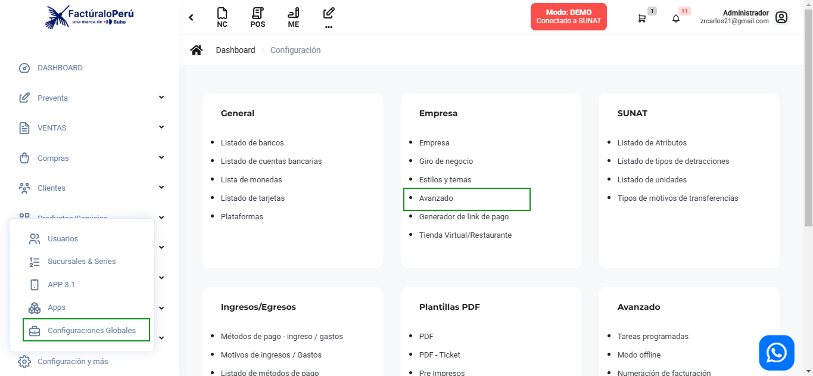

3. En **Avanzado**, ubica el módulo de **Contable** , donde ubicara la opcion de **Porcentaje retención IGV**

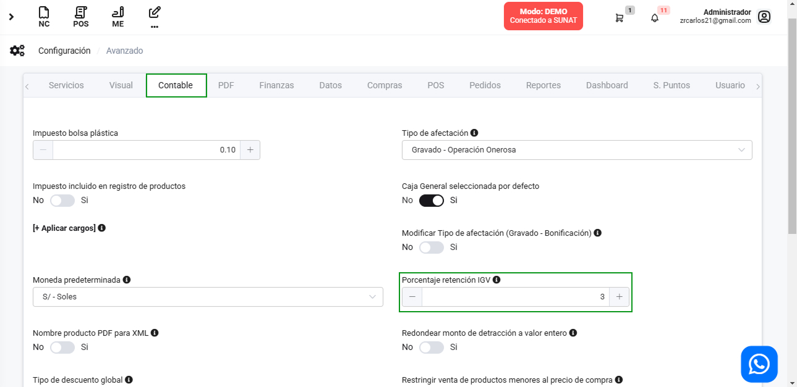

:::info IMPORTANTE
El porcentaje por defecto es 3%. Sin embargo, esto no significa que todas las actividades estén configuradas con este valor. Es necesario cambiarlo a 4% y luego volver a 3% para asegurarse de que la configuración se aplique correctamente.

:::

### Generar el comprobante 

En esta área podrás generar comprobantes electrónicos con retencion de IGV.Sigue estos pasos para realizarlo:

Ingresa al **módulo de ventas** y luego selecciona subcategoría **Nuevo Comprobante**.

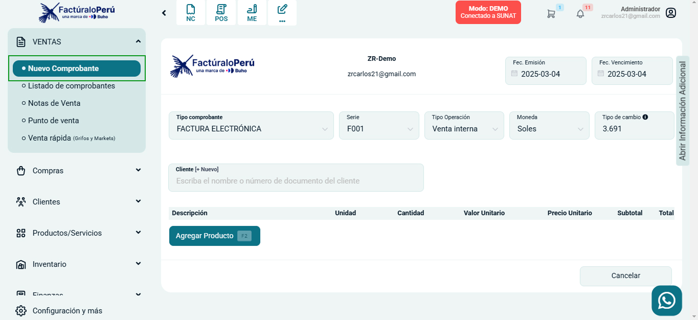

Como primer paso vamos a la opcion de **Informacion Adicional**.La encontrara en la seccion derecha del comprobante.

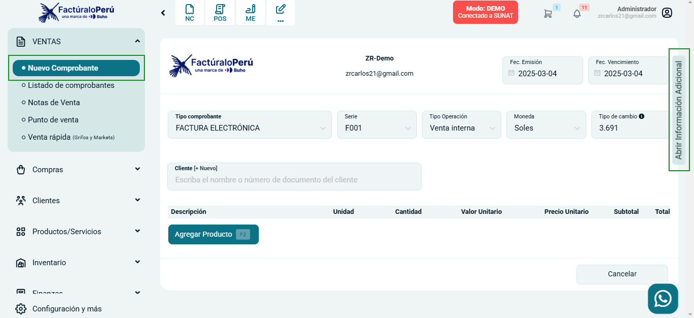

Saldra un menu despegable donde tendra que seleccionar la opcion **¿Tiene retencion de IGV?**

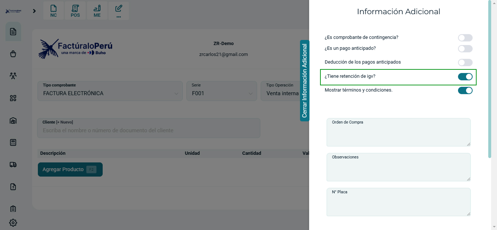

Una vez realizado estos pasos podemos continuar con la generacion del Comprobante.

**1. Crear comprobante**

En esta sección podrá empezar con la creación de su comprobante electrónico y realizar otras importantes configuraciones.

Se encontrará el formulario del tipo de comprobante y se completarán los siguientes datos:

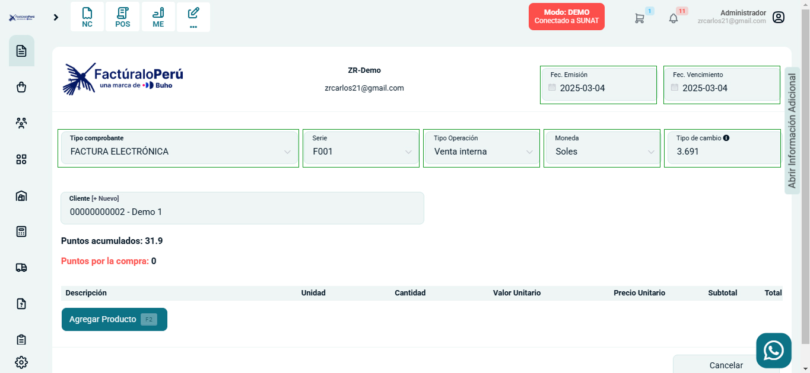

:::info IMPORTANTE

Se puede crear un comprobante con un día de retaso.

:::

- **Tipo de comprobante:** Selecciona factura o boleta electrónica
- **Serie:** Establecido por defecto según el tipo de comprobante
- **Tipo operación:** Seleccione la que más se adecue a la venta.
- **Moneda:** Seleccione moneda en dólares americanos o Soles
- **Tipo de cambio:** Es el tipo de cambio extraído por la SUNAT
- **Fecha de emisión:** Es el día que se emite el comprobante
- **Fecha de vencimiento:** Es el día que se tiene que pagar el comprobante.

:::danger IMPORTANTE:

Puede emitir boletas electrónicas por montos menores a 700 soles con el cliente **"Clientes Varios"**, cuando el monto sea mayor es obligatorio colocar la identidad del cliente sea DNI o RUC.

:::

**2. Crear nuevo cliente**
En esta sección escogerá el cliente para la creación del comprobante, caso contrario deberá crearlo seleccionando el botón **[+Nuevo]**.

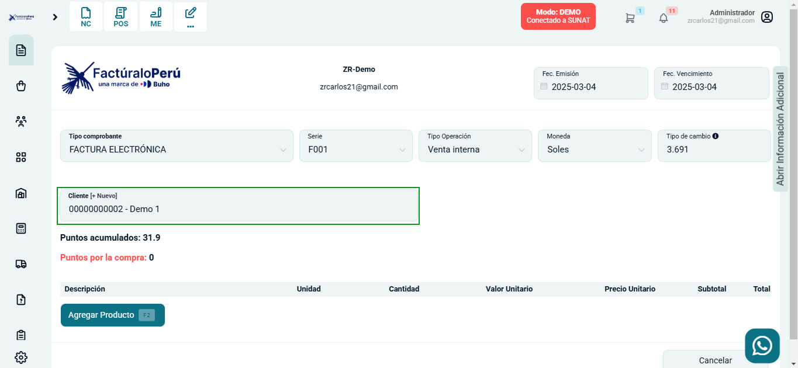

Posteriormente aparecerá el formulario de **Nuevo cliente**.

Para crear un nuevo cliente siga los pasos del siguiente **[articulo](https://manual.uio.la/Pro7/Modulos/Esenciales/clientes/Clientes-creacion-individual)**

:::danger

Todos los campos que cuentan con **(*)** son obligatorios.

:::

**3. Agregar Producto**

Selecciona el botón **Agregar producto.**

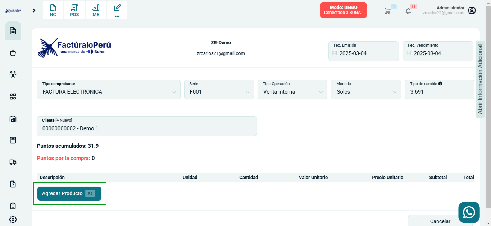

Posteriormente se encontrará el formulario de **Agregar Producto o Servicio**.

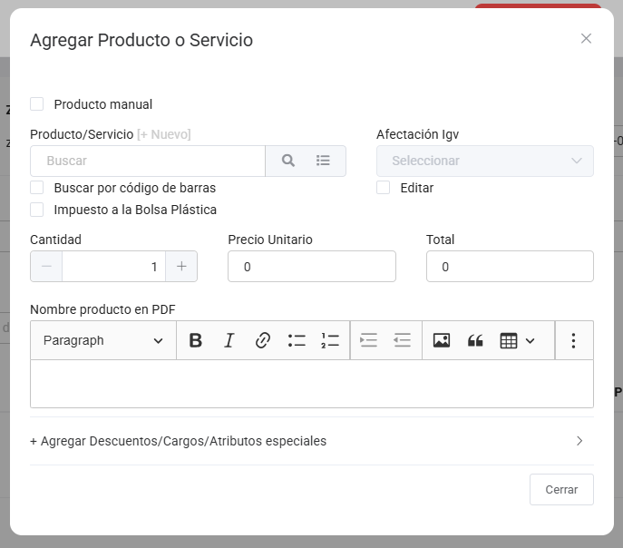

Para crear un nuevo producto siga los pasos del siguiente **[articulo](https://manual.uio.la/Pro7/Modulos/Esenciales/productos-servicios/Productos-Creacion-basica)**

Después selecciona el botón **Cerrar**, donde visualizará la descripción del producto.

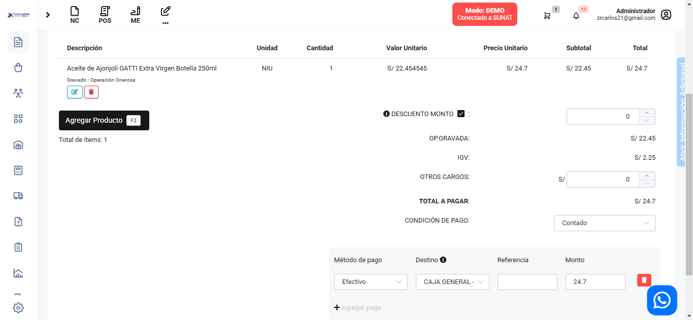

**4. Condiciones de pago** 

Selecciona el tipo de **Condición de pago** que mejor se acomode a tus requerimientos.

    1. Contado: Deberá escoger el método de pago, el destino donde ingresará el dinero automáticamente,la referencia y el monto en total. Además también es factible añadir otros métodos de pago.

    2. Crédito: El método de pago y la fecha a pagar, pueden ser configurados en CONFIGURACIÓN - Métodos de pago - Ingreso .

    3. Crédito a cuotas: Deberá escoger la fecha de pago y el monto,asimismo también es factible añadir la cantidad de cuotas que requiera.

**5. Después selecciona el botón Generar.**

Se visualizará una ventana indicando que la factura ha sido aceptada.

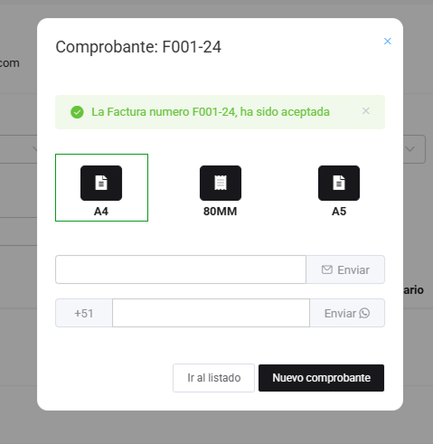

En este caso vamos a seleccionar la opcion **A4**

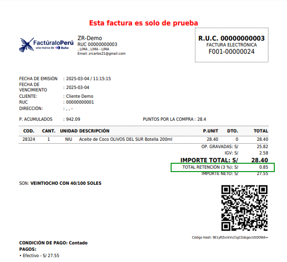

Donde podra visualizar su **Total de Retencion**, seleccionado previamente.