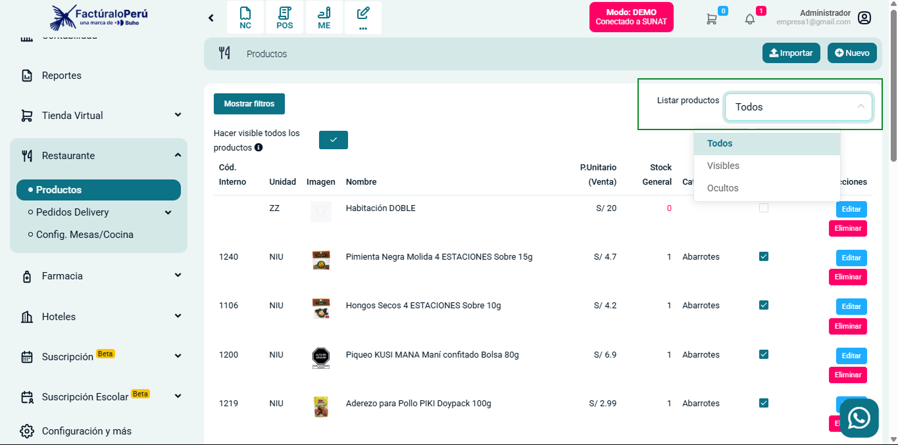

# Incorporación de filtro para listar productos según visibilidad en Tienda Virtual y Restaurante

Se añadió un filtro que permite listar los productos según su estado de visibilidad (visibles, ocultos o todos) en los módulos de Tienda Virtual y Restaurante. Esta mejora optimiza la gestión , permitiendo a los usuarios controlar y visualizar fácilmente los productos según su visibilidad del contexto.

