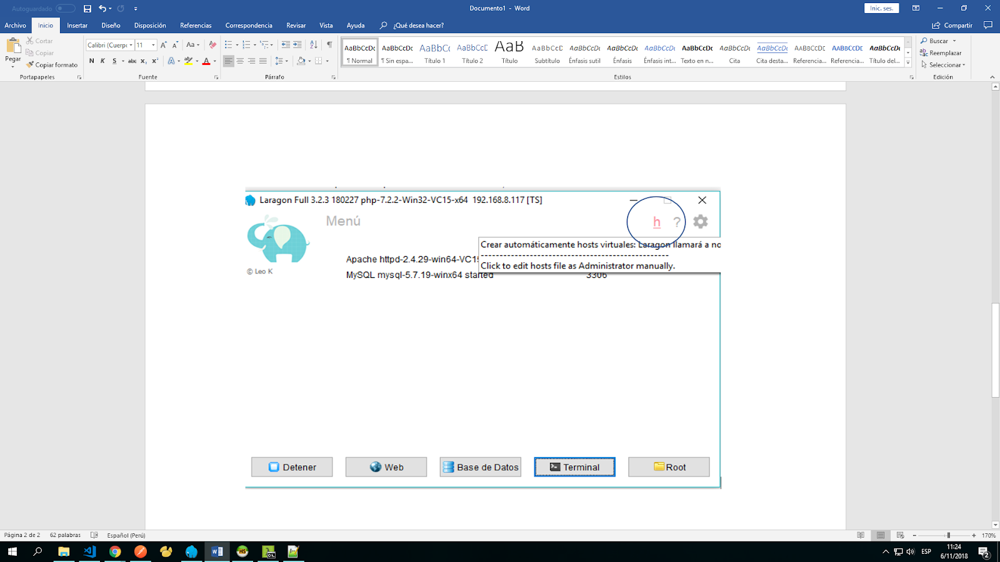
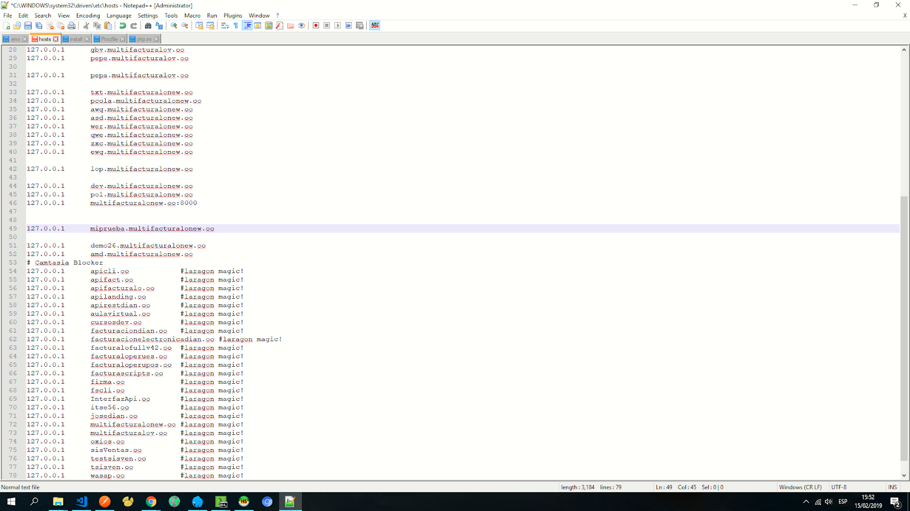

# Acceso red local - Laragon

En una red local se tienen 2 o más equipos. El ejemplo será con 2 equipos.

## Equipo A
- Debe tener instalado el proyecto.
- Poseer una IP estática, por ejemplo, 192.168.2.1.

## Equipo B
- Poseer una IP estática, por ejemplo, 192.168.2.2.

En ambos equipos se debe tener instalado Laragon. En el equipo B se debe editar el archivo `HOSTS` para crear un dominio enlazado al equipo A.

```
192.168.2.1         dominio-virtual-del-proyecto
```

## Configuración de los hosts
Para realizar la configuración de los hosts, diríjase a Laragon y en la esquina superior derecha, haga clic en la letra “h”.




Se abrirá el archivo de hosts, en el cual debe modificar lo mencionado anteriormente.




### Archivo hosts

Finalmente, debe reiniciar Laragon.
