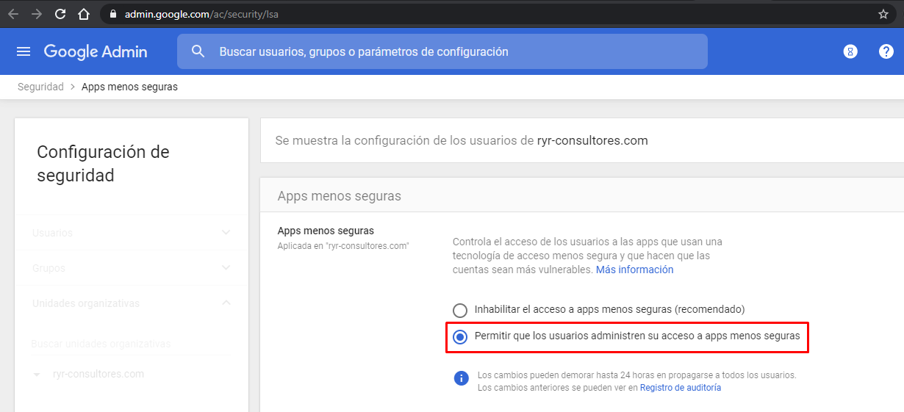

# Correo electrico emisor

## Requisitos previos

1. Tener acceso a su servidor, VPS, máquina virtual o local vía SSH. En las instalaciones que realizamos para AWS o Google Cloud, hacemos entrega del usuario, la IP del servidor y la clave SSH que puede ser un archivo .ppk o .pem.
2. Tener instalada una versión de SSH en su máquina para conectarse de manera remota. Puede utilizar PuTTY, FileZilla o una consola terminal.
3. Tener los accesos y credenciales de los entornos creados con Docker, usuario MySQL, root, entre otros, que también son entregados una vez realizada la instalación. Aunque una vez dentro de la instancia puede encontrarlos en los archivos `.env` y `docker-compose.yml`.

---

## Actualizar con Docker

1. Acceder de manera remota a su servidor.
2. Acceder como superusuario:
    ```bash
    sudo su
    ```
3. Ubicar la ruta raíz del proyecto (mayormente está en `/home/[usuario]/[nombre_del_proyecto]/`).
4. Acceder a la carpeta raíz:
    ```bash
    cd /home/usuario/proyecto/
    ```
5. Editar el archivo `.env`:
    ```bash
    nano .env
    ```
6. Se abrirá un editor, debe moverse hasta los parámetros:
    ```plaintext
    MAIL_DRIVER=smtp
    MAIL_HOST=smtp.gmail.com
    MAIL_PORT=465
    MAIL_USERNAME=
    MAIL_PASSWORD=
    MAIL_ENCRYPTION=ssl
    ```
7. Si usará Gmail, solamente agregue los campos `username` y `password`. Si posee un servidor de correos, debe configurar cada uno de los parámetros respectivamente.
8. Guardar el archivo.
9. Listar los contenedores de Docker, filtrando por el nombre `fpm`:
    ```bash
    docker ps --filter "name=fpm"
    ```
10. Copie los primeros 3 dígitos del `CONTAINER ID`.
11. Acceda al contenedor con el siguiente comando:
    ```bash
    docker exec -ti [3 dígitos] bash
    ```
12. Una vez ingresado, actualice el proyecto con el siguiente comando:
    ```bash
    php artisan config:cache
    ```
13. Se mostrarán dos líneas en texto color verde. Si es así, ya tendrá actualizada la herramienta.
14. Salga de las consolas con `exit`.
15. Ingrese al navegador, elimine la caché y realice un nuevo comprobante para comprobar el envío de correos.

---

## Actualizar con LAMP

1. Acceder de manera remota a su servidor.
2. Acceder como superusuario:
    ```bash
    sudo su
    ```
3. Ubicar la ruta raíz del proyecto (mayormente está en `/var/www/html/[nombre_del_proyecto]/`).
4. Acceder a la carpeta raíz:
    ```bash
    cd /var/www/html/proyecto/
    ```
5. Editar el archivo `.env`:
    ```bash
    nano .env
    ```
6. Se abrirá un editor, debe moverse hasta los parámetros:
    ```plaintext
    MAIL_DRIVER=smtp
    MAIL_HOST=smtp.gmail.com
    MAIL_PORT=465
    MAIL_USERNAME=
    MAIL_PASSWORD=
    MAIL_ENCRYPTION=ssl
    ```
7. Si usará Gmail, solamente agregue los campos `username` y `password`. Si posee un servidor de correos, debe configurar cada uno de los parámetros respectivamente.
8. Guardar el archivo.
9. Actualice el proyecto con el siguiente comando:
    ```bash
    php artisan config:cache
    ```
10. Se mostrarán dos líneas en texto color verde. Si es así, ya tendrá actualizada la herramienta.
11. Salga de las consolas con `exit`.
12. Ingrese al navegador, elimine la caché y realice un nuevo comprobante para comprobar el envío de correos.

---

## Condiciones

Al usar Gmail como correo emisor deberá habilitar el acceso a apps menos seguras. Esto lo hace ingresando a su cuenta de Google, menú de seguridad. Si ya está conectado, diríjase al siguiente enlace:  
[Google Security](https://myaccount.google.com/security)


### Google Suite

[Admin Google](https://admin.google.com/ac/security/lsa)



