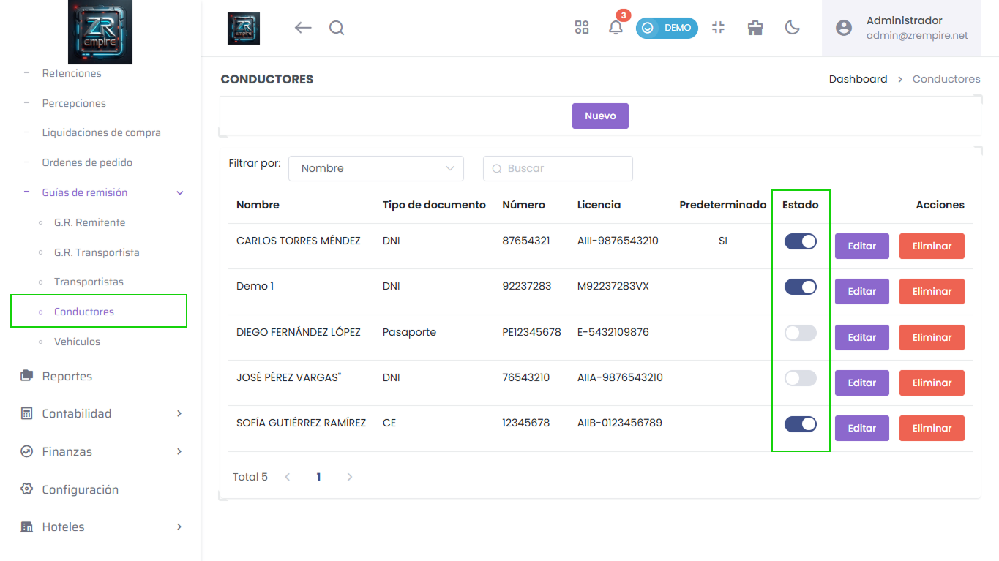

# Conductores: Estado Activo/Inactivo Corregido

Hemos solucionado un error que afectaba la correcta visualización y funcionamiento del estado (activo o inactivo) de los conductores. Ahora esta información se gestiona y muestra con total precisión en el sistema.

## Mejoras Implementadas

- Corrección en la visualización de estados
- Mejor gestión de estados activo/inactivo
- Mayor precisión en la información

