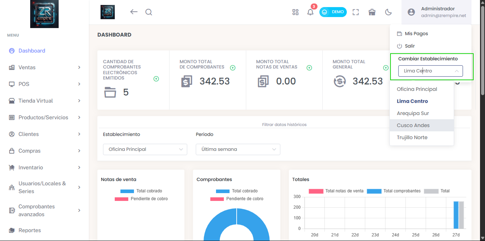

# Cambio de Establecimiento para Administradores

¡Nueva herramienta para administradores! Ahora pueden cambiar de forma ágil y sencilla entre los diferentes establecimientos que gestionan, optimizando la supervisión y el control de múltiples locales.

## Características Principales

- Cambio rápido entre establecimientos
- Gestión centralizada
- Control individual por local

## Beneficios

- Mayor eficiencia en la gestión
- Mejor control de establecimientos
- Supervisión optimizada

## Funcionalidades

- Cambio instantáneo de establecimiento
- Vista individual por local
- Reportes por establecimiento
- Control de acceso por local 