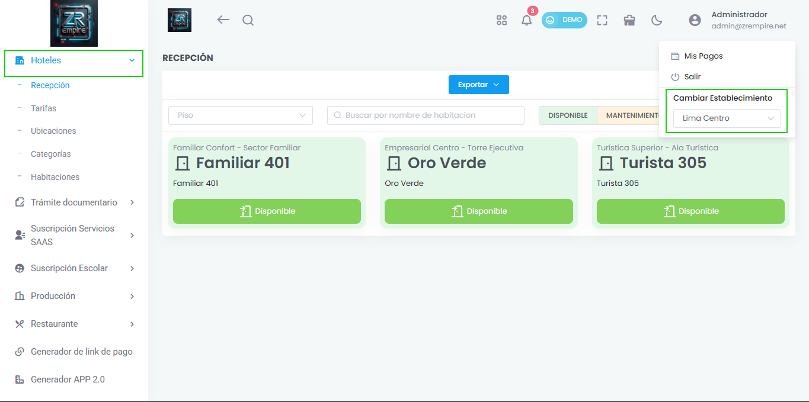

# Gestión Multihotel por Establecimiento

¡Expandimos tu capacidad de gestión! Ahora puedes administrar múltiples hoteles o establecimientos de forma individual y centralizada. Ideal para optimizar la operación de tu grupo hotelero.

## Características Principales

- Gestión centralizada de múltiples hoteles
- Control individual por establecimiento
- Interfaz unificada

## Beneficios

- Mejor organización de establecimientos
- Mayor eficiencia en la gestión
- Control centralizado

## Funcionalidades

- Administración por hotel
- Reportes individuales
- Gestión de inventario por establecimiento
- Control de usuarios por hotel 