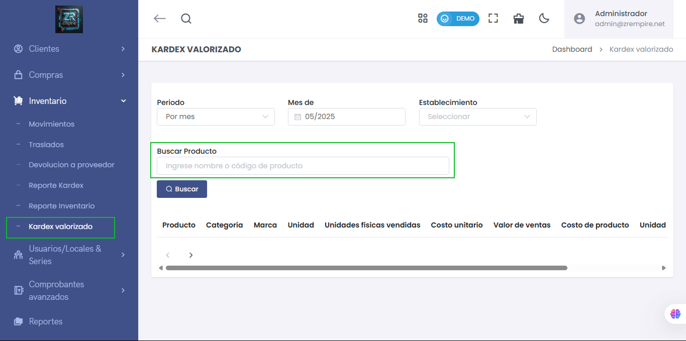

# Búsqueda de Productos en Kardex Valorizado

Se ha incorporado un campo de búsqueda para facilitar la consulta de productos en el submódulo **Kardex Valorizado**.

## ✅ Beneficios del cambio:
- Permite buscar por **nombre** o **código del producto**.
- Mejora la eficiencia al filtrar los resultados dentro de un periodo y establecimiento específico.
- Aumenta la precisión en el análisis de inventario valorizado.

📌 Acceso:  
`Inventario > Kardex Valorizado`  
➡️ Buscar por producto después de seleccionar el **mes** y el **establecimiento**.

---

> 💡 Esta mejora está orientada a brindar mayor control y rapidez en la visualización de costos, ventas y unidades vendidas desde una interfaz clara y optimizada.
