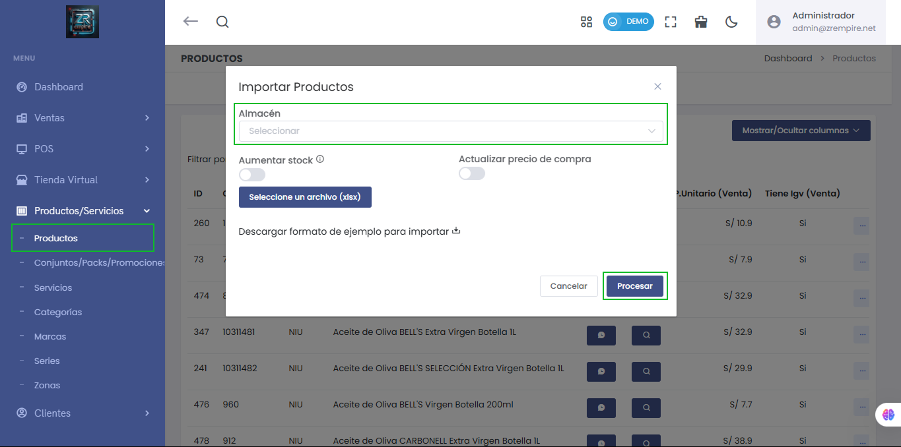

# Importación de Productos por Establecimiento

Ahora puedes importar productos seleccionando el **almacén o establecimiento** donde deseas que se registren, facilitando la gestión individualizada de inventarios. Esta mejora permite:

- ✅ Importar productos directamente a un almacén específico.
- 📦 Opción para **aumentar stock** de productos existentes.
- 💵 Posibilidad de **actualizar el precio de compra** durante la importación.
- 📂 Carga de archivo `.xlsx` con estructura definida.
- 📥 Descarga de formato de ejemplo para facilitar el proceso.

> 💡 Esta funcionalidad mejora el control y distribución de productos entre tus diferentes establecimientos, permitiendo una operación más eficiente y segmentada.

🔗 Accede desde el menú: `Productos/Servicios > Productos > Importar Productos`

---

⚠️ **Importante:** Asegúrate de seleccionar el almacén antes de procesar el archivo. El sistema no permitirá la importación si no se ha seleccionado un destino.

