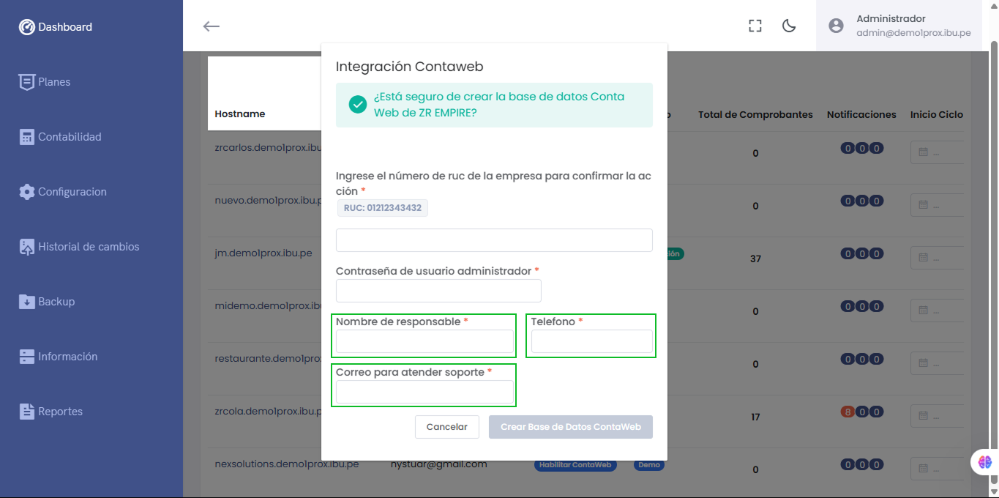

# Nueva Funcionalidad: Activación del soporte de ContaWeb

Se ha añadido una opción para activar el soporte de ContaWeb en el proceso de integración. Esto permite la sincronización automática de datos entre la plataforma y ContaWeb, facilitando tareas como gestión de clientes, inventarios y contabilidad.

---

## Cambios realizados

### Se han incorporado nuevos campos en la interfaz de integración:

- **Nombre de responsable:**  
  Permite ingresar el nombre de la persona responsable para la integración.

- **Teléfono:**  
  Permite ingresar un contacto telefónico asociado al responsable.

- **Correo para atender soporte:**  
  Campo destinado a ingresar el email para atención de soporte y notificaciones relacionadas.

---

## Notas adicionales

- La incorporación de estos campos es esencial para habilitar el soporte y la comunicación con ContaWeb.
- La activación solo será efectiva si los datos son correctos y se realiza el proceso de creación correctamente.

