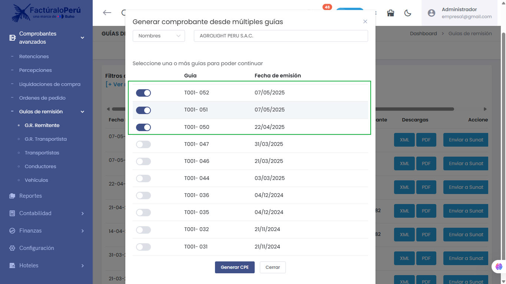
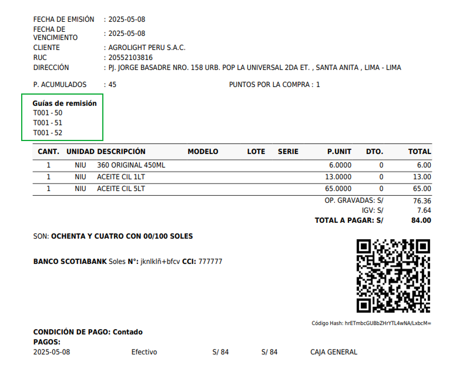

# 🛠️ Corrección Crítica: Generación de Comprobantes desde Múltiples Guías de Remisión

Se corrigió un conjunto de errores que afectaban la funcionalidad **"Generar comprobante desde múltiples guías de remisión"**.

## 🧾 Problemas detectados:
- ❌ Al seleccionar más de una guía, el comprobante solo reflejaba **una de ellas** en el PDF.
- ❌ En la lista para seleccionar guías, se mostraban guías que **ya habían sido utilizadas** previamente.
- ⚠️ Error general al intentar generar el CPE con múltiples guías seleccionadas.

## ✅ Soluciones aplicadas:
- ✅ Ahora se incluyen correctamente **todas las guías seleccionadas** en el CPE generado.
- ✅ El sistema **filtra correctamente** las guías ya usadas, evitando su selección.
- ✅ Se eliminó el error que impedía completar la generación del CPE con múltiples GRE.

📌 Módulo afectado:  
`Comprobantes Avanzados > Guías de Remisión > Generar CPE desde múltiples GRE`

---

`Ventas > Comprobante electrónico`

