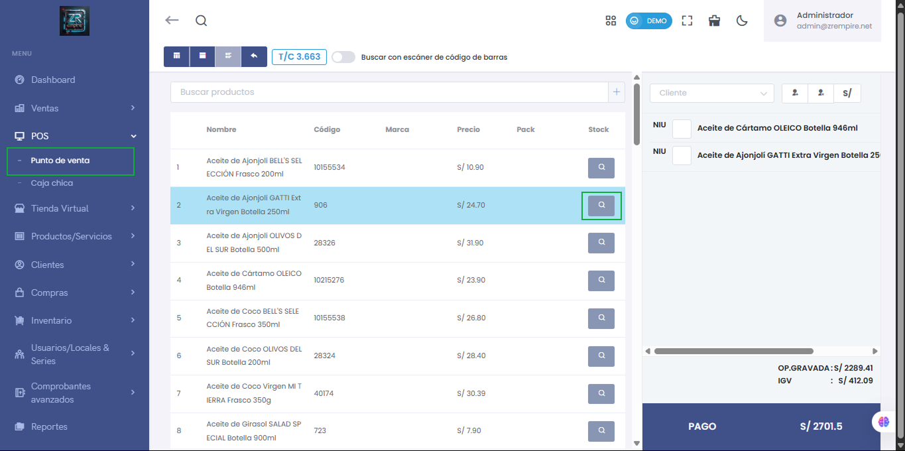

# 🛠️ Corrección de Error: Visualización de Stock en Búsqueda de Productos

Se solucionó un problema que impedía mostrar correctamente el **stock disponible** al buscar productos desde el modulo **POS** del sistema.

### 🔧 Detalles de la corrección:
- 🔍 El stock ahora se muestra correctamente al realizar búsquedas de productos.
- 📦 Se garantiza la sincronización con los movimientos de inventario.
- 🧭 Corrección aplicada en búsquedas rápidas desde ventas, POS y reportes de productos.

📌 Módulos afectados:  
`POS`

---

> ⚠️ Antes: Al buscar un producto, el stock aparecía en 0 o incorrecto.  
> ✅ Ahora: El sistema refleja el stock actualizado y real según almacén o establecimiento.
