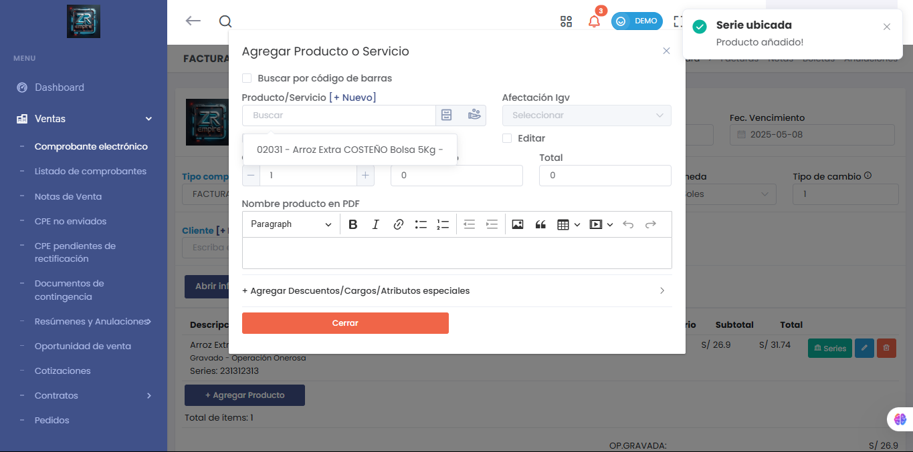

# 🛠️ Corrección de Error: Búsqueda de Producto por Serie en Nuevo CPE

Se corrigió un error que impedía localizar productos mediante su **número de serie** al generar un **nuevo comprobante electrónico (CPE)**.

### 🔧 Detalles de la corrección:
- 🔍 Ahora es posible buscar productos ingresando directamente el número de **serie asignada**.
- 🧾 Aplica al flujo de creación de facturas, boletas u otros CPEs.
- ⚙️ Mejora la trazabilidad y eficiencia en operaciones con productos seriados.

📌 Módulo afectado:  
`Ventas > Comprobantes Electrónicos (Nuevo CPE)`

---

> ⚠️ Antes: El sistema no reconocía la serie como criterio de búsqueda, dificultando la selección del producto.  
> ✅ Ahora: La búsqueda por serie funciona correctamente y muestra el producto relacionado.
