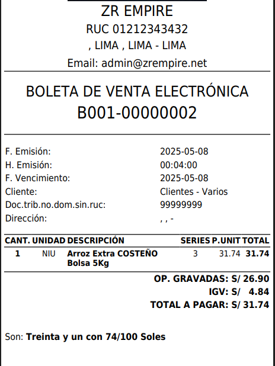

# 🛠️ Corrección de Error: Visualización de Serie en Ticket 80 (Template Default)

Se solucionó un error en el **template por defecto** del **Ticket 80mm**, que impedía mostrar el campo **Serie** del comprobante en la impresión.

### 🔧 Detalles de la corrección:
- 🧾 Ahora el campo **Serie** del comprobante se muestra correctamente en la impresión del ticket.
- 🖨️ Aplicable a impresoras térmicas con formato 80mm y template default.
- ✅ Mejora la identificación y trazabilidad del comprobante físico.

---

> ⚠️ Antes: El ticket impreso no mostraba la serie del documento.  
> ✅ Ahora: La serie se visualiza correctamente.
