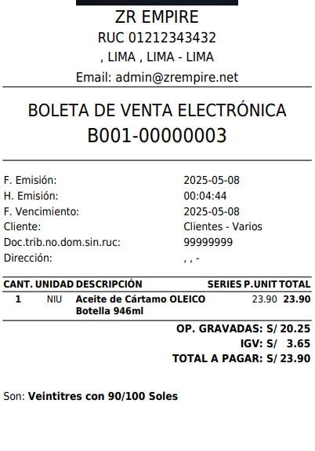

# 🛠️ Corrección de Error: Visualización del Total en Ticket de Boleta/Venta

Se solucionó un error que impedía mostrar el **importe total** en el **ticket impreso** correspondiente a boletas o ventas.

### 🔧 Detalles de la corrección:
- ✅ Ahora el total se muestra correctamente al final del ticket, incluyendo IGV (cuando corresponde).
- 🖨️ Aplicable a boletas electrónicas y ventas en formato de impresión tipo **ticket 80mm**.
- 🧾 Mejora la claridad para el cliente y la validez del comprobante físico.

📌 Módulo afectado:  
`Ventas > Comprobante Electronico`

---

> ⚠️ Antes: El total no aparecía o era omitido en la impresión.  
> ✅ Ahora: Se refleja correctamente el monto total a pagar, con formato claro y legible.
