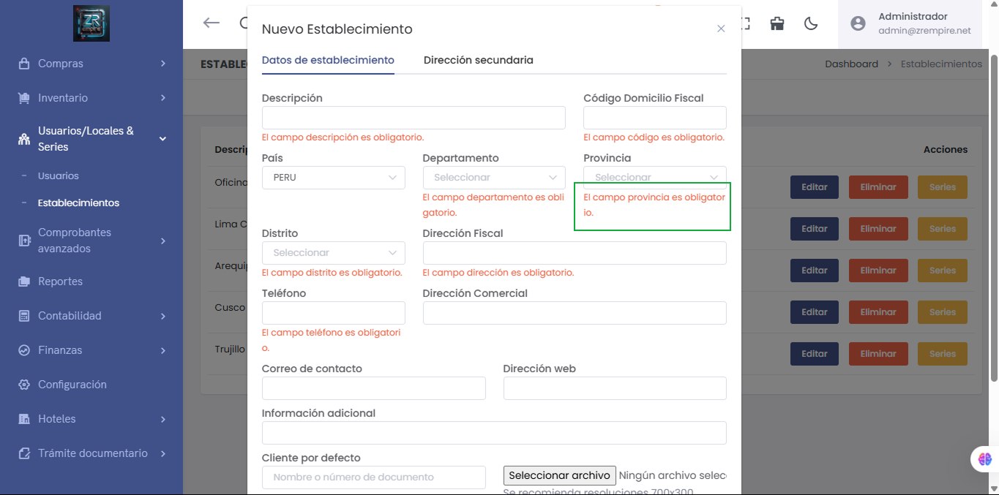

# Mensajes de Advertencia: Color Rojo Corregido y Estandarizado

Hemos realizado un ajuste visual en el sistema: los mensajes de advertencia ahora se mostrarán consistentemente en color rojo para asegurar su correcta identificación y destacar la información importante de manera inmediata.

La imagen anterior muestra cómo se visualizan ahora los mensajes de advertencia con el nuevo color rojo estandarizado.

## Mejoras Implementadas

- Estandarización del color rojo
- Mayor visibilidad de advertencias
- Mejor experiencia visual

## Beneficios

- Mayor claridad en mensajes
- Mejor identificación de alertas
- Interfaz más intuitiva

## Características

- Color rojo estandarizado
- Mejor visibilidad
- Interfaz más clara
- Mensajes más efectivos 